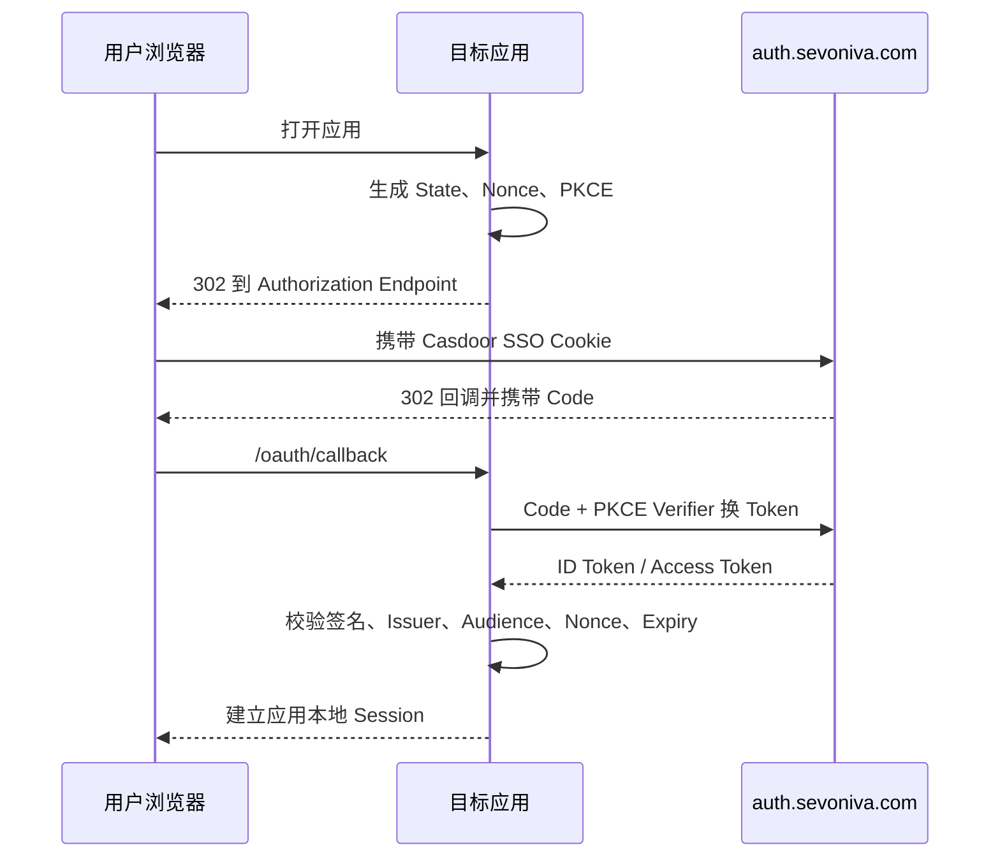

# Velora 应用 OIDC 接入指南

状态：Reference App 与 Spectra 已真实验收；本指南作为后续业务应用接入规范
适用角色：应用开发者、Velora 应用管理员、身份管理员

整体建设顺序和生产约束以[《Velora 新服务器整体建设与上线方案》](./production-clean-deployment-overall-plan.md)为准；本文件只定义下游应用如何接入。

账号创建、停用、应用角色下发和对账以[《Velora 统一账号与应用接入标准》](./account-provisioning-and-application-onboarding.md)为准。OIDC 只解决认证，不承载 Spectra 等应用业务角色；生产应用不得再使用 JIT 建号或默认授权。

## 0. 五分钟接入版

应用团队只需要完成下面五件事：

1. 提供应用生产地址和一个精确的 HTTPS Callback 地址。
2. 在 Velora 创建应用，启动地址填写应用自己的 OIDC 登录端点。
3. 为应用创建 Casdoor Client，只启用 Authorization Code，Scopes 使用 `openid profile email`。
4. 应用后端配置 `https://auth.sevoniva.com`、Client ID、Secret 文件和 Callback，并实现 PKCE、State、Nonce、ID Token 验签。
5. 在 Velora 绑定 Client、执行真实验证、配置可见范围并发布。

最小运行配置：

```text
OIDC_ISSUER=https://auth.sevoniva.com
OIDC_CLIENT_ID=<公开 Client ID>
OIDC_CLIENT_SECRET_FILE=/run/secrets/oidc-client-secret
OIDC_REDIRECT_URL=https://<应用域名>/<callback>
```

用户从 Velora 点击应用后，Velora 只负责权限检查和跳转；应用与 Casdoor 直接完成标准 OIDC 协议，登录成功后由应用创建自己的业务 Session。

## 1. 接入边界

- Velora 是应用目录、接入流程、访问范围、发布和审计平台。
- Velora 也是账号生命周期与应用授权控制面；管理员只在 Velora 开通、停用账号和分配应用角色。
- Casdoor 是认证事实来源，负责密码、MFA、SSO Session、Client 和 Token，并由 Velora 通过受控 M2M API 写入账号状态。
- 目标应用是 OIDC Relying Party，必须自行校验 Token 并实施业务权限。
- Velora 的门户访问策略只控制“谁能看到和启动应用”，不能替代目标应用内部授权。

## 2. 标准生产参数

```text
Issuer: https://auth.sevoniva.com
Discovery: https://auth.sevoniva.com/.well-known/openid-configuration
JWKS: 以 Discovery 返回的 jwks_uri 为准
Scopes: openid profile email
Flow: Authorization Code
PKCE: S256（必须）
```

不要使用以下地址作为应用配置：

```text
http://casdoor:8000
http://localhost:8443
https://home.sevoniva.com/casdoor
```

## 3. 应用团队需要提供

| 字段 | 示例 | 要求 |
|---|---|---|
| 应用名称 | `订单管理` | 用户可识别的正式名称 |
| 应用编码 | `order-center` | 小写字母、数字、短横线，创建后不修改 |
| 生产地址 | `https://orders.example.com` | 必须 HTTPS，不带账号、Query 和 Fragment |
| 回调地址 | `https://orders.example.com/oauth/callback` | 必须精确匹配，不使用通配符 |
| 登出回跳 | `https://orders.example.com/` | 必须为受控 HTTPS 地址 |
| 负责人 | 姓名/团队 | 用于配置变更和故障联系 |
| 访问范围 | 角色/用户组/用户 | 必须显式确认，默认拒绝 |

## 4. 管理员接入流程

1. 在 Velora 管理后台选择“接入应用”。
2. 填写基础信息并选择 `OIDC`。
3. 创建或绑定 Casdoor Client。
4. Client 必须启用：
   - `authorization_code`
   - `openid profile email`
   - Signin Session
5. 复制一次性 Client Secret 到应用 Secret Manager。
6. 在 Velora 选择访问范围。
7. 执行配置验证。
8. 应用团队部署配置后执行真实登录验收。
9. 检查预计影响用户、验证证据和回滚点。
10. 发布应用。

## 5. 应用配置

应用只从 Secret 文件或 Secret Manager 读取 Client Secret：

```text
OIDC_ISSUER=https://auth.sevoniva.com
OIDC_CLIENT_ID=<由 Casdoor/Velora 生成>
OIDC_CLIENT_SECRET_FILE=/run/secrets/oidc-client-secret
OIDC_REDIRECT_URL=https://<应用域名>/oauth/callback
OIDC_SCOPES=openid profile email
```

禁止：

- 将 Secret 写入 Git、镜像、前端变量或日志。
- 将 Access Token、Refresh Token、ID Token 返回给浏览器 LocalStorage。
- 使用密码模式替代 Authorization Code。
- 关闭 State、Nonce、PKCE 或 TLS 校验。
- 信任前端传入的用户 ID、角色或权限 Header。

## 6. 登录流程



正常情况下，用户已在 Velora 建立 Casdoor SSO Session，授权端点会直接回调，不再显示账号密码页面。

由 Velora 自动创建 Casdoor Client 时，必须同时启用 Signin Session 与 Auto Signin，并把 `providers`、`signupItems`、`signinItems`、`tags`、`samlAttributes`、`tokenFields` 等可选集合写成空数组而不是 `null`。否则 Casdoor 授权页可能白屏，或向已登录用户再次展示 Casdoor 登录入口。

## 7. Token 校验要求

目标应用必须校验：

- JWT 签名来自 Discovery 指定 JWKS。
- `iss` 精确等于 `https://auth.sevoniva.com`。
- `aud` 包含当前 Client ID。
- `exp` 未过期，`iat` 在允许时钟偏差内。
- `nonce` 与登录事务一致。
- Callback 的 `state` 与事务 Cookie/服务端状态一致且只消费一次。
- Authorization Code 只交换一次，并携带原 PKCE Verifier。

不能仅解析 JWT Payload 后直接信任 Claims。

## 8. 应用 Session 要求

- 应用创建自己的本地业务 Session，不复用 Velora 或 Casdoor Cookie。
- Cookie 使用 Host-only、Secure、HttpOnly、SameSite=Lax、Path `/`。
- 推荐 Cookie 名称使用 `__Host-` 前缀。
- 登录、Callback、登出响应添加 `Cache-Control: no-store`。
- Session 失效后重新发起 OIDC，不直接使用过期 Claims。
- 应用退出必须先清除自己的 Host-only Session，再调用 Casdoor RP-initiated logout；应用不能直接删除 Velora 或其他应用的 Cookie。
- 未实现并验证 OIDC Back-Channel Logout 前，不得宣称从任一应用退出会自动清理所有其他应用会话。

## 9. 权限边界

### Velora 访问策略

控制：

- 应用是否出现在员工门户。
- 用户能否调用 Velora 启动接口。

### 目标应用业务权限

控制：

- 用户进入应用后可查看的数据。
- 可以执行的业务操作。
- 交易、审批、导出等高风险动作。

目标应用必须默认拒绝未知用户/角色；不能因为用户能从 Velora 启动应用就授予管理员权限。应用只能为 Velora 已预配且状态为 `ACTIVE` 的账号建立会话。

## 10. 发布前验收清单

### 配置

- [ ] Discovery 可从目标应用运行环境访问。
- [ ] Issuer 为公网 HTTPS，且与 ID Token 一致。
- [ ] Client ID 与 Casdoor 完全一致。
- [ ] Redirect URI 精确匹配。
- [ ] 只启用需要的 Grant Type 和 Scope。
- [ ] Secret 来自受控 Secret 文件/Secret Manager。

### 安全

- [ ] State、Nonce、PKCE S256 全部启用。
- [ ] Token 签名、Issuer、Audience、Expiry 全部验证。
- [ ] Session Cookie 安全属性正确。
- [ ] 日志中无密码、Secret、Code、Cookie、Token。
- [ ] 非法 Callback、重放 Code、伪造 State 均被拒绝。

### 产品

- [ ] 用户在 Velora 登录一次后启动应用不再输入密码。
- [ ] 无权限用户看不到应用。
- [ ] 直接请求 Velora 启动 API 的无权限用户被拒绝。
- [ ] 应用显示正确名称、图标、负责人和帮助信息。
- [ ] 登出、会话过期和身份服务不可用时提示明确。

### 运维

- [ ] 应用有 `/healthz` 和 `/readyz`。
- [ ] Client Secret 轮换步骤已演练。
- [ ] 停用 Client 和 Velora 下架流程已演练。
- [ ] 回滚版本、配置和数据库备份可用。

## 11. 常见错误

### `issuer mismatch`

原因：应用使用了内部地址、旧域名或带 `/casdoor` 的地址。
处理：以公网 Discovery 返回的 Issuer 为唯一依据，并检查 ID Token 的 `iss`。

### `redirect_uri mismatch`

原因：协议、域名、路径、端口或末尾斜杠不完全一致。
处理：复制应用实际 Callback 地址，精确配置到 Casdoor，不使用通配符。

### 启动应用后再次出现登录页

原因：Casdoor 浏览器 SSO Session 没有建立、过期或被清除。
处理：检查 Velora Session Bridge、`auth.sevoniva.com` Cookie 和 Casdoor Signin Session 配置；不要通过共享父域 Cookie绕过。

### Casdoor 授权页白屏

原因：Client 的 `signupItems` 等集合字段被保存为 `null`，Casdoor 前端调用数组方法时异常。

处理：通过 Velora 的 Client 自动化重新发布配置，确保可选集合为 `[]`；同时检查浏览器控制台是否存在 `Cannot read properties of null (reading 'find')`。不要修改 Casdoor 源码规避脏配置。

### `invalid_client`

原因：Client ID/Secret 错误、Secret 已轮换、应用被停用。
处理：核对 Secret 文件挂载和 Casdoor Client 状态，禁止在日志打印 Secret。

### JWKS/Discovery 不可达

原因：DNS、证书链、Nginx 反代或 Casdoor `origin` 错误。
处理：先检查外网 Discovery 和证书，再检查容器内 Casdoor 健康状态。

### 配置完整但登录入口返回 503

原因：运行应用的非 root 容器无法读取挂载的 Client Secret。Compose 的文件型 Secret 可能保留宿主机 UID/GID 和权限，宿主机 `0600` 并不代表容器用户可读。

处理：确认容器实际 UID，并将 Secret 设为该 UID 所有、只读，例如 `chown 65532:65532` 与 `chmod 0400`；只检查文件存在不够，必须在容器内验证 `test -r`。禁止为了省事改成全员可读。

## 12. Reference App 验收结果模板

```text
应用：velora-oidc-demo
环境：production（单机）
Issuer：https://auth.sevoniva.com
Client ID 后四位：已写入服务器 Secret/运行时配置，不写入文档
Redirect URI：https://demo.sevoniva.com/oauth/callback
Discovery：PASS
JWKS：PASS
Authorization Code + PKCE：PASS
ID Token 验证：PASS
免二次登录：PASS（已有 Casdoor Session 时不再显示密码页）
无权限访问：PASS（Demo 不暴露 Velora 管理接口）
登出：PASS（Demo 本地会话 + Casdoor RP-initiated logout）
Secret 泄漏扫描：PASS（代码与日志不包含运行时 Secret）
执行时间：2026-08-21
执行人：部署验收自动化
关联提交：`e953f03`（文档状态同步提交随后补充）
回滚点：上一已验证 commit/image digest；数据库恢复演练已通过
```

该模板必须由真实运行结果填写，禁止预填 PASS。

## 13. Spectra 生产接入记录

```text
应用：Spectra
应用编码：spectra
环境：production
应用地址：https://spectra.sevoniva.com
Issuer：https://auth.sevoniva.com
启动地址：https://spectra.sevoniva.com/api/v1/auth/oidc/login
Callback：https://spectra.sevoniva.com/api/v1/auth/oidc/callback
Flow：Authorization Code + PKCE S256
Velora 状态：ENABLED / PUBLISHED
访问策略：EVERYONE
Discovery：PASS（Velora 服务端真实请求）
跳转参数：PASS（公网 302，State、Nonce、PKCE、Client ID、Callback 已核对）
事务 Cookie：PASS（HttpOnly、Secure、SameSite=Lax）
Spectra 健康检查：PASS（数据库迁移版本 45）
Velora 登录与跨域 Session Bridge：PASS（公网 303、Host-only Secure Cookie、一次性票据重放 410）
Casdoor 无感授权：PASS（已登录用户不再展示 Casdoor 账号密码页）
OIDC Callback 与 Spectra 本地 Session：PASS（真实浏览器最终进入 /home）
执行时间：2026-08-22
Spectra main：963321e
服务器回滚点：/home/ubuntu/spectra-deploy/backup-20260821T231748Z-main
```

账号生命周期生产验收：PASS（carson 创建、停用、恢复、developer 角色、重复和乱序事件）。OIDC 浏览器登录仍按每个新应用执行一次业务验收。
