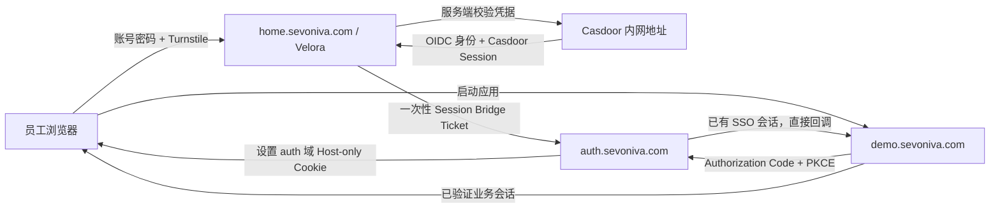
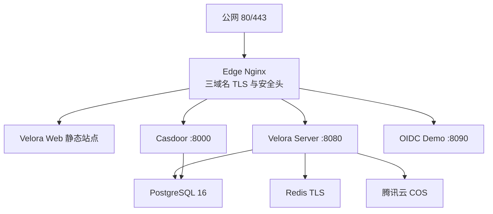

# Velora 公网身份域名与 Reference App 可实施方案

状态：整体方案待确认；证书已完成只读预检，DNS 待切换，尚未部署
计划身份域名：`auth.sevoniva.com`
计划演示应用域名：`demo.sevoniva.com`
生产门户：`https://home.sevoniva.com`
目标服务器：`175.27.250.53`（4C / 8G，SSH 用户 `ubuntu`）

建设原则：新服务器按全新生产环境初始化，不迁移旧服务器的数据库、账号、配置、镜像、证书目录或运行数据；旧服务器不属于本方案范围，也不作为新环境回滚依赖。只有用户确认本方案后才开始安装、开发和部署。

本文件是身份域与 Demo 的专项实施细则；总体顺序、资源、安全、部署和上线结论以[《Velora 新服务器整体建设与上线方案》](./production-clean-deployment-overall-plan.md)为准。

## 1. 目标

本方案解决的不是“再做一个演示页面”，而是用一个可运行的真实 OIDC Client 验收 Velora、Casdoor 和下游应用之间的完整闭环：

1. 用户始终在 Velora 登录页输入企业账号和密码。
2. Casdoor 不向普通用户暴露管理界面，也不要求用户再次输入密码。
3. Velora 登录成功后，同时建立 Velora 会话和 `auth.sevoniva.com` 上的 Casdoor 浏览器 SSO 会话。
4. 用户从 Velora 启动 Demo App 时，Demo App 通过标准 OIDC Authorization Code + PKCE 接入 Casdoor。
5. Casdoor 因已有浏览器会话而直接签发授权码，用户不出现第二次登录页面。
6. Demo App 完整验证 Issuer、Audience、签名、Nonce、State、PKCE 和有效期。
7. Velora 能显示应用从草稿、身份待配置、验证、发布到停用的状态与证据。
8. 形成可交给后续应用团队直接执行的接入文档和验收脚本。

## 2. 本次不做

- 不修改 Casdoor 源码。
- 不恢复 Velora 自建 OIDC Provider。
- 不接入 SAML、CAS、Forward Auth 或 SCIM。
- 不扩展邮件、通用待办等非应用接入功能。
- Demo App 不承载真实业务数据，不作为业务脚手架。
- 不把 Casdoor Client Secret、浏览器会话 ID 或 Token 写入数据库、日志、前端存储和审计详情。
- 不迁移或复用旧服务器的 PostgreSQL 数据、Casdoor 配置、Velora 用户和 Secret。
- 方案确认前不修改新服务器，不切换 DNS，不创建公网服务。

## 3. 为什么需要两个新域名

### `auth.sevoniva.com`

该域名直接代理 Casdoor 根路径，提供公网可访问的：

- `/.well-known/openid-configuration`
- `/.well-known/jwks`
- `/login/oauth/authorize`
- `/api/login/oauth/access_token`
- `/api/userinfo`
- `/api/logout`
- Casdoor 管理控制台（仅管理员入口）

Casdoor 的 `origin`、Discovery 中的 Issuer、ID Token 的 `iss`、Velora 配置和所有下游应用配置必须统一为：

```text
https://auth.sevoniva.com
```

不继续使用 `https://home.sevoniva.com/casdoor/` 作为正式 OIDC 地址。路径反代容易造成 Discovery、静态资源、Cookie Path 和回调地址不一致。

### `demo.sevoniva.com`

Demo App 必须运行在独立域名，才能真实验证跨应用浏览器 SSO。若把 Demo 挂在 `home.sevoniva.com` 的路径下，只能证明同域路由可用，不能证明后续独立应用能免二次登录。

## 4. DNS 与证书实测结果

2026-08-21 已完成只读预检：

| 项目 | 结果 |
|---|---|
| `home.sevoniva.com` 目标解析 | `175.27.250.53`；等待 DNS 切换后复验 |
| `auth.sevoniva.com` 目标解析 | `175.27.250.53`；等待 DNS 切换后复验 |
| `demo.sevoniva.com` 目标解析 | `175.27.250.53`；等待 DNS 切换后复验 |
| Home 证书包 | `/Users/chuncheng/Downloads/home.sevoniva.com_nginx.zip` |
| Auth 证书包 | `/Users/chuncheng/Downloads/auth.sevoniva.com_nginx.zip` |
| Demo 证书包 | `/Users/chuncheng/Downloads/demo.sevoniva.com_nginx.zip` |
| Home SAN | `DNS:home.sevoniva.com` |
| Auth SAN | `DNS:auth.sevoniva.com` |
| Demo SAN | `DNS:demo.sevoniva.com` |
| Home 证书/私钥 | 公钥指纹匹配，通过 |
| Auth 证书/私钥 | 公钥指纹匹配，通过 |
| Demo 证书/私钥 | 公钥指纹匹配，通过 |
| 完整链 | 三个 bundle 均包含 3 张证书 |
| 签发机构 | TrustAsia DV TLS RSA CA 2024 |
| Home 有效期 | 2026-08-21 11:00:00 UTC 至 2026-11-19 10:59:59 UTC |
| Auth/Demo 有效期 | 2026-08-21 12:00:00 UTC 至 2026-11-19 11:59:59 UTC |

结论：三套证书的域名覆盖、证书链和私钥匹配满足实施前置条件；DNS 尚未切换，不能标记为已通过。证书约 90 天有效，部署时必须同步加入 30/15/7 天到期告警和续期操作说明。

新环境不继承旧 Casdoor Application。实施时重新创建 Velora Client 和 Demo Client，并显式开启 `enable_signin_session`。新环境从第一次启动就使用共享 Redis，不允许先以内存 Cache 作为“临时生产方案”。

### 服务器安装目标

实施时只解压需要的 bundle 与 key，CSR 不上传服务器运行目录：

```text
/opt/velora/runtime/certs/auth.sevoniva.com/fullchain.pem
/opt/velora/runtime/certs/auth.sevoniva.com/privkey.pem
/opt/velora/runtime/certs/demo.sevoniva.com/fullchain.pem
/opt/velora/runtime/certs/demo.sevoniva.com/privkey.pem
/opt/velora/runtime/certs/home.sevoniva.com/fullchain.pem
/opt/velora/runtime/certs/home.sevoniva.com/privkey.pem
```

目录权限 `0700`，私钥 `0600`，证书 `0644`，属主为 root。证书和私钥不提交 Git，不打印私钥内容或公钥指纹到应用日志。

## 5. 用户准备项

### DNS

```text
home.sevoniva.com  A  175.27.250.53
auth.sevoniva.com  A  175.27.250.53
demo.sevoniva.com  A  175.27.250.53
```

当前状态：等待用户修改解析。正式切换前先用 `curl --resolve` 验证三个虚拟主机；切换后再从公网、Mac 和服务器侧分别复验。

### 证书

以下任一方案均可：

1. 一张包含 `home.sevoniva.com`、`auth.sevoniva.com`、`demo.sevoniva.com` 的 SAN 证书；或
2. `*.sevoniva.com` 通配符证书；或
3. 两套独立证书。

交付文件必须包含完整证书链和私钥，推荐命名：

```text
auth.sevoniva.com.fullchain.pem
auth.sevoniva.com.key
demo.sevoniva.com.fullchain.pem
demo.sevoniva.com.key
home.sevoniva.com.fullchain.pem
home.sevoniva.com.key
```

私钥不提交 Git，只放服务器 root 可读目录，权限 `0600`。如果私钥有口令，不在聊天或仓库中传递口令。

## 6. 最终架构



### 单机生产拓扑

新服务器只对公网开放 `22/tcp`、`80/tcp`、`443/tcp`。所有业务容器只加入 Docker 内部网络，不映射数据库、Redis、Casdoor、Velora Server 和 Demo 端口：



部署形态采用一个独立生产 Compose Project：

- `edge`：唯一公网入口，持有三套只读证书，按 Host 路由。
- `web`：仅提供 Velora SPA 静态文件，不再自己占用宿主机 80/443。
- `server`：Velora 模块化单体后端，非 root、只读根文件系统。
- `casdoor`：不改源码，只通过 `auth.sevoniva.com` 暴露标准 OIDC 协议和受控管理入口。
- `oidc-demo-client`：真实标准 OIDC Client，不读取 Velora Session。
- `postgres`：全新初始化两个独立数据库和最小权限账号。
- `redis`：Bridge Ticket、OIDC State、登录限流和服务端会话缓存；不暴露公网端口。

数据库、Redis 与应用网络使用 `internal: true`；`edge` 同时连接公网边缘网络和应用网络。镜像使用国内镜像源拉取并固定 digest，禁止使用浮动 `latest`。

### Cookie 边界

| Cookie | 所属域名 | 作用 | 要求 |
|---|---|---|---|
| Velora Session | `home.sevoniva.com` | Velora 登录会话 | Host-only、HttpOnly、Secure、SameSite=Lax |
| Casdoor Session | `auth.sevoniva.com` | 多应用统一 SSO 会话 | Host-only、HttpOnly、Secure、SameSite=Lax |
| Demo Session | `demo.sevoniva.com` | Demo App 本地业务会话 | `__Host-` 前缀、HttpOnly、Secure、SameSite=Lax |

禁止设置 `Domain=.sevoniva.com` 的共享会话 Cookie，避免任一子域影响其他系统会话。

## 7. Velora 登录后的 Casdoor Session Bridge

当前 Velora 后端通过 Casdoor `/api/login` 校验密码并交换 OIDC Code，但 Casdoor 返回的浏览器 Session Cookie 被服务端丢弃。因此 Velora 登录成功不等于下游应用已有 SSO 会话。

### 新流程

1. 浏览器向 Velora `POST /api/v1/auth/login` 提交账号、密码和 Turnstile Token。
2. Velora 校验 Turnstile、限流和请求长度。
3. Velora 服务端调用 Casdoor `/api/login`。
4. Casdoor 返回 OIDC Code 和 `casdoor_session_id`；Velora继续完成 ID Token 校验。
5. Velora 创建本地会话，同时生成 256 bit 随机一次性 Bridge Ticket。
6. Casdoor Session ID 只进入短期 Cache，键使用 Ticket 哈希，TTL 30 秒。
7. 登录接口返回固定 Bridge Action 和一次性 Ticket，不返回 Session ID；登录响应必须 `Cache-Control: no-store`：

   ```text
   bridge_action=https://auth.sevoniva.com/_velora/session/bridge
   bridge_ticket=<opaque-ticket>
   ```

8. 前端创建隐藏表单，将 Ticket 放入 `application/x-www-form-urlencoded` Body，整页 `POST` 到 Bridge Action；禁止把 Ticket 拼入 URL。
9. `auth.sevoniva.com` 的 Nginx 仅将 `/_velora/session/bridge` 代理到 Velora Server，其他路径全部代理到 Casdoor。
10. Bridge Handler 原子消费 Ticket，在 `auth.sevoniva.com` 响应中设置 Host-only `casdoor_session_id`，然后以 HTTP 303 跳回服务器预先保存的 Velora 内部路径。
11. Bridge 只接受 POST；GET、Ticket 被使用/过期、Host 不符或 Cookie 缺失时全部失败关闭，不进入门户。

### Bridge 安全要求

- Ticket 至少 32 字节真随机，只使用 Base64URL/Hex 安全字符。
- Cache 中只保存 30 秒，不落数据库；使用 Compare-And-Delete 防重放。
- 返回地址由服务端在 Ticket Payload 中保存，禁止从 URL 接受任意 `return_url`。
- Bridge 只允许请求 Host 为 `auth.sevoniva.com`。
- Bridge 路径关闭访问日志和请求体日志；任何代理层都不得记录 Ticket。
- 响应包含 `Cache-Control: no-store`、`Pragma: no-cache`、`Referrer-Policy: no-referrer`。
- Casdoor Cookie 名称必须精确匹配 `casdoor_session_id`，缺失或重复均失败。
- Casdoor Session ID、Ticket、密码、授权码、Token 不进入应用日志、错误信息和审计详情。
- Bridge 失败后前端显示“统一会话建立失败”，并撤销当前 Velora 会话，避免半登录状态。

### Cache 分阶段策略

- 新生产环境第一次启动即启用共享 Redis；Bridge Ticket、OIDC State 和登录限流使用独立前缀。
- Redis 不映射公网端口，启用 TLS、认证、容量上限、AOF 和 `noeviction`，密码只通过 Secret 文件注入。
- 不允许以数据库表替代短期 Ticket Cache，避免浏览器 Session Artifact 落入长期持久化和备份。

### 登出

由于三个 Cookie 都是 Host-only，任一域名都不能直接删除另一个域名的 Cookie。必须按入口分别定义登出：

Velora 发起退出：

```text
Velora revoke session
  -> https://auth.sevoniva.com/api/logout?...post_logout_redirect_uri=https://home.sevoniva.com/login
  -> Velora 登录页
```

Demo 发起退出：

```text
Demo clear local session
  -> Casdoor RP-initiated logout
  -> Velora logout completion
  -> Velora 登录页
```

Velora 退出保证清除 Velora 与 Casdoor 会话，但不能直接删除已经存在的 Demo Cookie；Demo 退出按上面链路清理三层会话。后续其他应用必须清理自己的本地 Session，再进入统一退出链路。除非以后实现并验证 OIDC Back-Channel Logout，否则不宣称从任意入口能同步清理所有已接入应用。

## 8. Nginx、资源与生产基线

### 独立 Edge Nginx

现有 Web 容器同时承担 SPA 和单域名 TLS，不适合三域名生产入口。实施时拆为“Edge Nginx + 内部 Web 静态服务”，由 Edge 统一处理 HTTP 跳转、TLS、Host 校验、请求大小、限流、安全头和上游超时。

Edge 必须配置默认拒绝 Server：未知 Host 的 HTTP/HTTPS 请求直接关闭或返回 444，不允许落到任一业务站点。三个 HTTPS Server Block 分别绑定自己的证书，不使用错误域名证书兜底。

#### `home.sevoniva.com`

- 保持 Velora SPA 与 `/api/` 代理。
- 删除普通用户路径对 Casdoor 的依赖。
- 管理员入口跳转到 `https://auth.sevoniva.com`。
- `/api/v1/auth/login` 使用独立限流区；真实 IP 只信任明确配置的代理网段。

#### `auth.sevoniva.com`

```nginx
server_name auth.sevoniva.com;

location = /_velora/session/bridge {
    access_log off;
    limit_except POST { deny all; }
    proxy_pass http://server:8080/_velora/session/bridge;
    proxy_set_header Host $host;
    proxy_set_header X-Forwarded-Proto https;
    proxy_set_header X-Real-IP $remote_addr;
}

location / {
    proxy_pass http://casdoor:8000;
    proxy_set_header Host $host;
    proxy_set_header X-Forwarded-Proto https;
    proxy_set_header X-Forwarded-Host $host;
    proxy_set_header X-Real-IP $remote_addr;
    proxy_set_header X-Forwarded-For $proxy_add_x_forwarded_for;
}
```

实际实现必须保留动态 Docker DNS 解析，且 `proxy_pass` 不能错误保留 `/casdoor/` 前缀。

#### `demo.sevoniva.com`

- `/` 代理 Demo App。
- 仅暴露 `GET /`、`GET /login`、`GET /oauth/callback`、`POST /logout`、`GET /healthz`。
- 设置 HSTS、CSP、X-Content-Type-Options、Referrer-Policy 和 Permissions-Policy。

### 4C / 8G 资源预算

以下是单机首发上限，不是容量承诺；上线后按实际指标调整：

| 服务 | CPU 上限 | 内存上限 | 说明 |
|---|---:|---:|---|
| Edge + Web | 0.50C | 384 MiB | 静态资源与反向代理 |
| Velora Server | 1.00C | 1024 MiB | 主业务进程 |
| Casdoor | 0.75C | 768 MiB | 身份服务 |
| OIDC Demo | 0.25C | 128 MiB | 仅验收用途 |
| PostgreSQL | 1.25C | 2048 MiB | 两个独立数据库、连接上限受控 |
| Redis | 0.25C | 384 MiB | 最大内存与 AOF 受控 |
| 轻量监控/日志任务 | 0.50C | 768 MiB | 不对公网暴露 |

总上限允许短时 CPU 竞争，但稳定内存目标控制在 5.5 GiB 内，为内核、Docker Page Cache、备份和升级保留至少 1.5 GiB。服务器现有 2 GiB Swap 保留作为故障缓冲，不把 Swap 当可用容量。

### 主机与容器安全基线

- Ubuntu 使用腾讯云/受控国内 apt 源；Docker 镜像优先经 DaoCloud/内部镜像仓库，Go 使用 `https://goproxy.cn` 且不回退 `direct`，pnpm 使用 `https://registry.npmmirror.com`。
- SSH 只允许密钥登录，禁止 root 远程登录和密码登录；`ubuntu` 通过 sudo 运维。
- 防火墙仅开放 `22/80/443`；PostgreSQL、Redis、Casdoor、Server、Demo 均不绑定宿主机公网地址。
- 容器使用非 root、`read_only`、`no-new-privileges`、最小 capabilities、健康检查、日志轮转和资源限制。
- Secret 放在 `/opt/velora/runtime/secrets`，目录 `0700`、文件 `0600`，不写入 `.env`、Compose、Git、命令行参数或日志。
- 三套 TLS 私钥只挂载给 Edge；应用容器不可读取。
- Turnstile Site Key 可进入前端配置，Secret Key 只由 Velora Server 读取并通过 Cloudflare Siteverify 服务端校验。
- 数据库每日加密备份到 COS 独立前缀，保留 7 个日备、4 个周备；首次上线前必须完成一次恢复演练。
- 设置证书到期、磁盘、容器重启、5xx、登录失败率、PostgreSQL 连接和备份失败告警。

### Casdoor 配置

```text
origin=https://auth.sevoniva.com
```

Casdoor 内部通信继续使用：

```text
http://casdoor:8000
```

公网 Issuer 与内网请求地址必须分离，不能再次把内网地址作为 Issuer。

### Velora 生产配置

```text
VELORA_PUBLIC_URL=https://home.sevoniva.com
VELORA_OIDC_ISSUER=https://auth.sevoniva.com
VELORA_OIDC_INTERNAL_URL=http://casdoor:8000
VELORA_OIDC_REDIRECT_URL=https://home.sevoniva.com/auth/callback
VELORA_OIDC_POST_LOGOUT_REDIRECT_URL=https://home.sevoniva.com/login
VELORA_CASDOOR_ACCOUNT_URL=https://auth.sevoniva.com/account
VELORA_CASDOOR_ADMIN_URL=https://auth.sevoniva.com
VELORA_CASDOOR_ALLOWED_HOSTS=auth.sevoniva.com
VELORA_IDP_SESSION_BRIDGE_ENABLED=true
VELORA_IDP_SESSION_BRIDGE_PUBLIC_URL=https://auth.sevoniva.com/_velora/session/bridge
VELORA_IDP_SESSION_BRIDGE_HOST=auth.sevoniva.com
VELORA_IDP_SESSION_BRIDGE_TTL=30s
VELORA_CASDOOR_PASSWORD_LOGIN_ENABLED=true
VELORA_TURNSTILE_SITE_KEY=<public-site-key>
VELORA_TURNSTILE_SECRET_FILE=/run/secrets/velora-turnstile-secret
VELORA_TURNSTILE_HOSTNAMES=home.sevoniva.com
VELORA_TURNSTILE_ACTION=login
VELORA_CACHE_PROVIDER=redis
VELORA_COMPLIANCE_PROFILE=standard
VELORA_CRYPTO_PROVIDER=standard
VELORA_CRYPTO_ADAPTER=software
VELORA_CRYPTO_KEY_FILE=/run/secrets/velora-crypto-key
```

生产环境 `VELORA_OIDC_ALLOW_HTTP` 必须为 `false`。当前代码的生产门禁会拒绝 Password Login；实施必须将其改为组合式安全门禁：只有 HTTPS、Turnstile、Redis Bridge、限流、安全 Cookie 和 Casdoor OIDC 全部有效时才允许启用，任一缺失则启动失败。禁止通过使用非生产环境名绕过门禁。

本轮 `standard` Profile 允许 root-only Secret 文件提供标准软件加密，并在健康/验收证据中明确为非金融级；`financial` Profile 必须继续拒绝 software adapter，未安装真实国密 KMS/HSM/PKCS#11 adapter 时失败关闭。

## 9. Reference App 设计

### 技术选择

- 目录：`server/cmd/oidc-demo-client`
- 语言：Go
- 依赖：`github.com/coreos/go-oidc/v3`、`golang.org/x/oauth2`
- 交付：单二进制、非 root 容器、只读根文件系统
- 预计常驻内存：控制在 40 MB 内
- 不引入 Node Runtime、独立数据库、Redis 或前端构建链

### 页面与接口

| 路径 | 行为 |
|---|---|
| `GET /` | 未登录显示登录入口；已登录显示脱敏用户 Claims 与验证结果 |
| `GET /login` | 生成 State、Nonce、PKCE Verifier，设置短期事务 Cookie，跳转 Casdoor |
| `GET /oauth/callback` | 校验 State、交换 Code、校验 ID Token、创建 Demo Session |
| `POST /logout` | 清除 Demo Session，跳转 Casdoor RP-Initiated Logout |
| `GET /healthz` | 进程存活检查，不返回敏感配置 |
| `GET /readyz` | Discovery/JWKS 可达性检查 |

### Demo App 配置

```text
DEMO_PUBLIC_URL=https://demo.sevoniva.com
DEMO_OIDC_ISSUER=https://auth.sevoniva.com
DEMO_OIDC_CLIENT_ID=<Casdoor generated client id>
DEMO_OIDC_CLIENT_SECRET_FILE=/run/secrets/demo-oidc-client-secret
DEMO_OIDC_REDIRECT_URL=https://demo.sevoniva.com/oauth/callback
DEMO_OIDC_POST_LOGOUT_REDIRECT_URL=https://demo.sevoniva.com/
DEMO_SESSION_KEY_FILE=/run/secrets/demo-session-key
DEMO_COOKIE_SECURE=true
DEMO_LISTEN_ADDR=:8090
```

### OIDC 安全要求

- 仅使用 Authorization Code Flow。
- 必须启用 PKCE S256、State、Nonce。
- ID Token 必须验证签名、Issuer、Audience、Nonce、Expiry、IssuedAt。
- Token 只保存在服务端加密 Session 或内存，不进入 LocalStorage/SessionStorage。
- 页面只展示允许的脱敏 Claims：`sub` 截断值、用户名、显示名、邮箱、认证时间。
- 不展示 Access Token、Refresh Token、ID Token 原文。
- Session Cookie 使用 `__Host-velora_demo_session`、Path `/`、Secure、HttpOnly、SameSite=Lax。
- Callback、登录和登出响应全部 `Cache-Control: no-store`。

### Casdoor Demo Client

```text
Name: velora-oidc-demo
Organization: built-in
Homepage URL: https://demo.sevoniva.com
Redirect URI: https://demo.sevoniva.com/oauth/callback
Post Logout Redirect URI: https://demo.sevoniva.com/
Grant Type: authorization_code
Scopes: openid profile email
Token Format: JWT
Enable Signin Session: true
```

Client Secret 只在创建时展示一次，写入服务器 Secret 文件，不写进 Compose、环境示例、日志或文档。

## 10. Velora 应用接入产品改造

### 入口整合

将当前三个分散入口：

- 应用管理
- 身份与单点登录
- 访问策略

整合为应用管理中的“接入应用”向导。原页面可保留为高级视图，但不再作为主路径。

### 向导步骤

1. 基础信息：名称、编码、负责人、图标、分类。
2. 接入类型：普通链接 / OIDC。
3. 身份客户端：创建或绑定 Casdoor Client。
4. 访问范围：所有人、组织、角色、用户组、用户。
5. 配置验证：Discovery、JWKS、Client、Redirect URI、Grant Type。
6. 真实登录验收：打开 Reference App 并记录结果。
7. 发布确认：配置差异、影响用户、审批与回滚点。

### 状态模型

```text
DRAFT
  -> IDENTITY_PENDING
  -> VERIFICATION_PENDING
  -> READY
  -> PUBLISHED
  -> DISABLED

失败分支：VERIFICATION_FAILED
```

禁止仅凭 Discovery 可达就显示“真实验证通过”。验证结果至少拆分为：

- Discovery 与 Issuer
- JWKS
- Casdoor Client 存在
- Client ID 一致
- Redirect URI 一致
- Grant Type/Scopes 合规
- 最近一次真实浏览器登录验收

### 访问策略

- 新 OIDC 应用默认不可见、不可启动。
- 管理员必须显式选择“所有人”或指定范围。
- ROLE/GROUP/USER 不再要求手输字符串，改成可搜索目录选择器。
- 发布前显示预计可访问用户数量和示例用户。

## 11. 代码修改清单

### Server

- `server/internal/platform/identitysource/provider.go`
  - 捕获并严格验证 Casdoor `casdoor_session_id`。
  - 将身份结果与短期 Session Artifact 分开返回。
- `server/internal/adapters/kratosapi/federated_login.go`
  - 创建 Bridge Ticket。
  - 不把 Casdoor Cookie 写入 JSON、日志或审计。
- `server/internal/platform/httpserver/session_bridge.go`
  - 新增严格 Host 校验、一次性 Ticket 消费、Set-Cookie 和 303 跳转。
- `server/internal/bootstrap/app.go`
  - 注入 Bridge Cache/配置并在 SPA fallback 前注册专用 Handler。
- `server/internal/platform/config/config.go`
  - 增加 Bridge 开关、URL、Host、TTL，完成生产配置校验。
- `server/api/proto/forge/v1/identity.proto`
  - `LoginResponse` 增加 `bridge_action` 和 `bridge_ticket`，重新生成 Go/OpenAPI/Web API；响应禁止缓存。
- `server/internal/app/portal/service.go`
  - 拆分 OIDC 验证项，禁止 Discovery 单项通过即发布。
- `server/internal/platform/casdooradmin/client.go`
  - 增加只读配置对比能力和客户端漂移检查。
- `server/cmd/oidc-demo-client/`
  - 新增 Reference App。

### Web

- `web/src/pages/Login.tsx`
  - 登录成功后校验 `bridge_action` 的 Scheme/Host/Path，创建隐藏表单并将 `bridge_ticket` 作为 POST Body 整页提交。
- `web/src/api/api.ts`
  - 消费 Bridge 字段；未知地址、缺少 Ticket 或非 HTTPS 地址失败关闭。
- `web/src/pages/admin/Applications.tsx`
  - 新建后直接进入接入向导。
- `web/src/pages/admin/IdentityIntegrations.tsx`
  - 合并为应用级向导视图；显示逐项验证结果。
- `web/src/pages/admin/Policies.tsx`
  - 使用目录选择器与命中预览。

### Deployment

- `deployments/docker/velora-edge.conf.template`
  - 新建独立 Edge，配置 default-deny 与 home/auth/demo 三个 Server Block。
- `deployments/docker/velora-internal-web.conf`
  - Web 容器只提供内部 SPA 静态服务，不再持有生产 TLS 私钥。
- `deployments/docker/Dockerfile.demo`
  - Demo App 多阶段构建、非 root、只读运行。
- `deployments/env/prod/docker-compose.yml`
  - 新增 `edge`、`oidc-demo-client` 和 Turnstile/Demo Secret，所有内部服务取消 Host 端口，增加 CPU/内存/只读约束。
- `deployments/env/prod/.env.example`
  - 增加三域名、Bridge、Turnstile 和 Demo 的非敏感配置项，Secret 只填写文件路径。
- `scripts/check-production-config.sh`
  - 校验公网 Issuer、Bridge Host、三域名证书、Turnstile、Redis 和 Demo Callback。

## 12. 与整体方案的实施映射

本文件不再定义另一套 R0–R5 流程，避免执行代理重复开发。实施统一服从整体方案 P0–P4：

- P0：完成生产表单登录组合门禁、Redis、配置契约和服务器开发/正式隔离。
- P1：完成公网 Issuer、Edge、POST Session Bridge、Cookie 安全和准确登出语义。
- P2：完成 Go Demo Client、Casdoor Demo Client 和免二次登录闭环。
- P3：完成应用接入向导、验证、访问策略和管理员入口。
- P4：完成正式 Compose、DNS/TLS、真实 E2E、备份恢复和接入文档。

每个阶段都直接在 `main` 完成聚焦测试后 Conventional Commit 并 push。Issuer 不一致、Ticket 可重放/泄漏、共享父域 Cookie、未授权启动或 Secret 进入日志均为阶段阻断项，必须修复后继续，禁止带病发布。

## 13. 测试矩阵

### 单元测试

- Ticket 随机性、TTL、一次性消费、并发消费。
- Cookie 名称、Secure、HttpOnly、SameSite、Host-only、Path。
- Host allowlist、固定返回地址、开放重定向拒绝。
- State、Nonce、PKCE、Issuer、Audience、Expiry。
- 登录失败不产生 Bridge Ticket。
- Casdoor 未返回 Session Cookie 时失败关闭。

### 集成测试

- Fake OIDC Server 覆盖正常和错误 Discovery/JWKS/Token。
- Velora 登录接口到 Bridge Handler 的完整请求。
- Bridge Ticket 重放返回 401/410，且不再次设置 Cookie。
- Demo App Callback 只接受一次事务。

### 线上冒烟

```text
GET https://auth.sevoniva.com/.well-known/openid-configuration -> 200 JSON
GET https://auth.sevoniva.com/.well-known/jwks -> 200 JSON
GET https://demo.sevoniva.com/healthz -> 200
GET https://demo.sevoniva.com/readyz -> 200
GET https://home.sevoniva.com/healthz -> 200
```

禁止在命令输出中打印 Client Secret、密码、Session Cookie 和 Token。

## 14. 生产验收标准

只有全部满足才算完成：

- 外网 Discovery 的 Issuer 为 `https://auth.sevoniva.com`。
- ID Token `iss` 与 Discovery 完全一致。
- Demo App 使用独立域名和独立 Host-only Session。
- Velora 登录后启动 Demo App，不出现第二个账号密码页面。
- Demo App 不接收或保存 Velora Session。
- Velora 不成为下游应用的 Token Issuer。
- Casdoor 普通用户只经过协议端点，不暴露管理入口。
- 未验证应用不能发布。
- 未授权用户在列表、详情和启动 API 三层均被拒绝。
- 所有 Secret 来自 root-only 文件或 Secret Manager。
- `go test ./...`、Web 测试、配置检查、E2E 和服务器冒烟全部通过。
- 完成数据库、配置和二进制三类回滚验证。

## 15. 回滚方案

### Issuer/Edge 回滚

- 在 DNS 切换前直接停止新环境的身份入口，不影响任何旧系统。
- 在 DNS 切换后恢复本次新环境上一份已验证的 Edge/Casdoor/Velora 配置和镜像。
- 不把流量自动指回旧服务器；回滚目标必须由用户明确指定。

### Session Bridge 回滚

- 关闭 `VELORA_IDP_SESSION_BRIDGE_ENABLED`。
- 前端回退为原 Velora 本地会话跳转。
- 删除 Cache 中 `idp-session-bridge:*` 短期键。
- 不删除用户或 Casdoor Application。

### Demo/E2E 回滚

- 从 Velora 下架 Demo App。
- 停止 `oidc-demo-client` 容器。
- 在 Casdoor 停用 Demo Client，保留审计记录。
- 不影响 Velora 主站和现有用户。

数据库迁移必须向前兼容；如需新增表，仅允许新增，不在同一版本删除或重命名现有列。

## 16. 执行效率

本专项不单独估算人工工作日，直接纳入整体方案 P0–P4 连续执行。开发代理不得用重复规划、长时间观察或压力测试延迟推进；完成一个可运行切片后立即测试、提交、push 并继续。只有缺少不可推导的 DNS/外部输入时才暂停。

## 17. 开始实施前的确认项

1. [x] 使用 `auth.sevoniva.com`。
2. [x] 使用 `demo.sevoniva.com` 进行跨域 SSO 验收。
3. [ ] DNS 切换到 `175.27.250.53` 后，从公网和新服务器双向复验。
4. [x] Home/Auth/Demo 三套证书覆盖正确域名、证书链完整且私钥匹配。
5. [x] 继续保留 Velora 页面账号密码登录，并采用一次性 Session Bridge，不切换到 Casdoor 登录页。
6. [ ] 用户确认《Velora 新服务器整体建设与上线方案》后再开始实施。

## 18. 依据

- Casdoor OIDC Discovery：<https://casdoor.org/docs/integration/java/spring-security/spring-security-oauth/>
- Casdoor 登录成功会在启用 Signin Session 时设置统一会话：<https://github.com/casdoor/casdoor/blob/master/controllers/auth.go>
- Casdoor Session Cookie 名称与 Session Provider：<https://github.com/casdoor/casdoor/blob/master/main.go>
