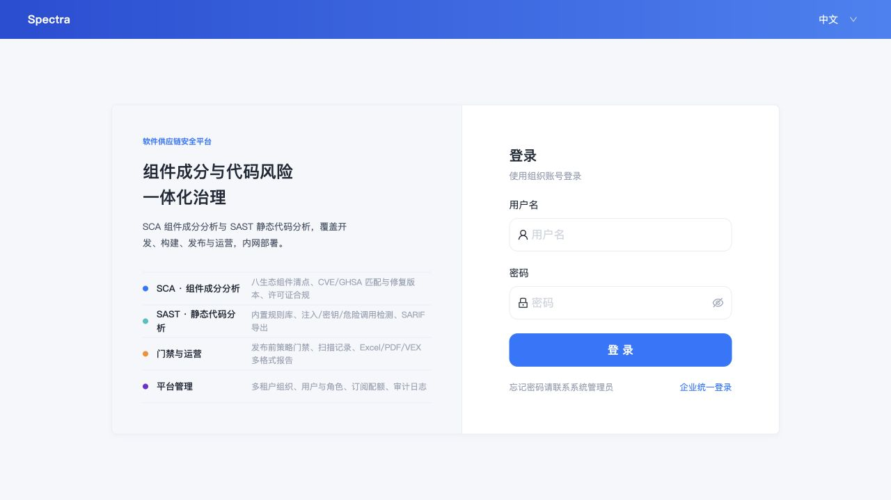
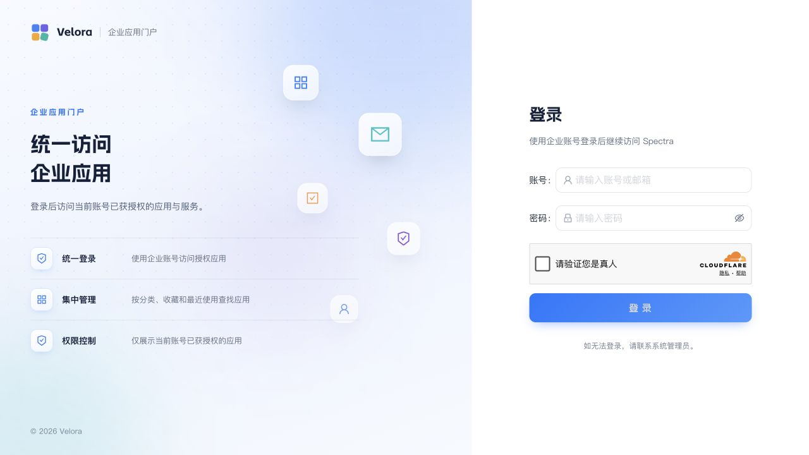
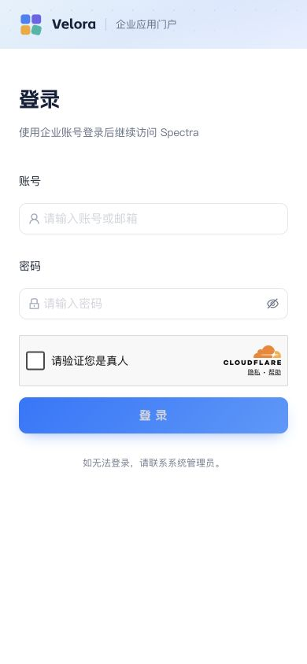

# Velora 产品级 / 生产级 / 金融级就绪度复审

> 复审日期：2026-08-23（Asia/Shanghai）
>
> 代码基线：`299fa896cc03365ea32511f6f5db72d5e5d0927f`（`main`）
>
> 线上环境：`home.sevoniva.com`、`auth.sevoniva.com`、`spectra.sevoniva.com`
>
> 结论性质：基于当前源码、自动化测试、线上只读检查和公开用户旅程的点时审计；未执行破坏性故障演练、验证码代答或管理员登录后的全量人工回归。

## 1. 一句话结论

Velora 已经不是“只有页面和脚手架的半成品”：统一门户登录、Casdoor 身份引擎、应用目录、用户与授权管理、Spectra 样板接入、审计、对象存储、生产编排等核心链路均已有真实实现并在线运行。

但是当前只能批准为**单机、有限用户、有人值守的受控试运行版**，不能宣称为成熟企业生产平台，更不能宣称达到金融级。主要原因不是页面数量不足，而是生产控制闭环尚未完成：身份入口仍可绕开门户、强认证未强制、发布门禁失效、备份和证书没有自动调度、监控告警没有上线、单机无容灾、国密/KMS/HSM 没有实际启用。

| 维度 | 当前判定 | 是否可对外宣称完成 |
| --- | --- | --- |
| 产品 MVP | 基本完成，可开展受控试运行 | 可以，但应明确 V1 边界 |
| 产品级 | 部分完成，仍有身份体验和管理闭环缺口 | 不可以 |
| 生产级 | 单机运行可用，运维与发布保障不足 | 不可以 |
| 金融级 | 仅有部分代码能力和校验骨架，生产配置未达标 | 不可以 |

不建议用一个虚假的百分比掩盖差距。按发布门槛判断：**P0 阻断项全部关闭后，才能从“受控试运行”升级为“正式生产 V1”；金融级需要单独立项。**

## 2. 当前已经做成的部分

### 2.1 产品与身份链路

- Velora 登录页已成为 Spectra 企业登录的统一入口；Spectra 发起 OIDC 后会回到带应用上下文的 `home.sevoniva.com/login?app=spectra...`。
- 下游授权请求通过 Velora 授权网关校验应用状态、客户端 ID、精确回调地址和 PKCE，再以内置跳转交给 Casdoor。
- Velora 自建 OIDC Provider 在生产编排中明确关闭；Casdoor 继续作为协议和身份引擎，边界方向正确。
- 用户创建、启停和 Spectra entitlement 已有实现；用户停用会同步 Casdoor，并禁用已有应用授权。
- 没有应用权限时返回空应用列表是合理产品状态，不再等同于系统错误。
- 管理台已具备用户、角色、应用、目录分类、审计、审批、临时授权、会话、API Token 等基础能力。

### 2.2 工程质量

- 后端共 88 个 `_test.go` 文件；本次 `go test -race ./...` 全部通过。
- `go vet ./...` 通过。
- 前端 8 个测试文件、44 项测试全部通过，`oxlint`、TypeScript 编译和 Vite 生产构建通过。
- 前端生产依赖使用 npm 官方审计端点复核，未发现已知漏洞；国内镜像本身不支持 npm audit API，不能把“国内源构建成功”当作依赖安全检查。
- 线上主机仅公开 22、80、443；PostgreSQL、Redis、Casdoor 和业务服务没有直接发布宿主端口。
- 数据库、Redis 使用 TLS；主要 Secret 通过只读文件注入而不是明文环境变量。
- 当前 8 个容器持续运行，除 worker 未定义健康检查外其余均显示 healthy；近 12 小时未观察到重启或 OOM。

## 3. P0：正式生产 V1 上线阻断项

| 编号 | 证据与差距 | 产品/生产影响 | 可实施改法 | 验收标准 |
| --- | --- | --- | --- | --- |
| P0-01 | `auth.sevoniva.com/` 与 `/login` 当前直接返回 Casdoor SPA；`deployments/docker/edge.conf:135-145` 把所有未匹配路径代理给 Casdoor。这与“Casdoor 永不作为用户可见入口”的边界冲突。 | 用户可看到 Casdoor 品牌和登录/管理面；形成第二登录入口、弱化统一风控，并扩大身份系统攻击面。 | auth 域名改为默认拒绝；仅公开 OIDC discovery、token、userinfo、JWKS、logout 等协议端点；authorize 继续只进 Velora 网关。Casdoor 管理面使用内网/VPN/独立受控域名，Velora 管理员入口只做受审计跳转。 | 公网访问 `/`、`/login`、Casdoor 管理/API UI 返回 404/403；Spectra 完整 OIDC 登录、刷新、退出仍通过。 |
| P0-02 | Spectra 登录页仍把本地账号密码作为主表单，“企业统一登录”只是次级文字入口。 | 用户不知道哪个账号体系权威；本地账号成为治理旁路，离职/停用/审计无法保证统一。 | 普通生产用户只展示“企业统一登录”；本地登录仅保留 break-glass 管理员，限制来源 IP、强 MFA、独立审计并默认隐藏。 | 普通账号无法本地登录；Velora 停用用户后 Spectra 登录、现有会话和 API 权限在批准时限内全部失效。 |
| P0-03 | 线上 `admin`、`carson` 均未设置首选 MFA，邮件/手机 MFA 均未启用；生产配置也没有 MFA 强制策略。 | 密码泄露即可能接管门户或管理权限；金融级不可接受。 | 先强制系统管理员 TOTP/WebAuthn，再强制所有交互用户；恢复码一次展示、加密存储；break-glass 双人保管和定期轮换。 | 管理员 100% MFA；普通用户按策略 100% 或基于风险强制；绕过、恢复、失败行为均进入审计。 |
| P0-04 | 仓库没有 `.github` 工作流；`scripts/check-production-config.sh` 当前因缺少 `VELORA_CERTS_DIR` 直接失败，且脚本仍期待已从 Compose 删除/移动的 Prometheus、Grafana 和 `web` 直接发布 80/443。 | 没有可重复发布证据；错误配置可能直接上线；文档所称 CI 与现实不一致。 | 修复静态门禁以匹配 edge 架构；建立 main 必须通过的 CI：race test、vet、前端测试/lint/build、生产 Compose 校验、迁移检查、SAST/SCA、secret scan、镜像与 SBOM。 | 从干净 clone 一条命令通过；失败检查阻止 main 发布；每次发布可追溯到 commit、镜像 digest、迁移和回滚点。 |
| P0-05 | 仅有 2026-08-21 的一次 Velora/Casdoor 双库加密签名备份和一次手工 SQL；线上没有 Velora 备份 cron/systemd timer，也没有可验证的异地副本与周期恢复演练。 | 主机、磁盘或误操作故障时无法证明可恢复；Casdoor 与门户数据可能时间点不一致。 | systemd timer 每日双库一致性备份，上传 COS 独立前缀并启用版本/保留策略；每月恢复到隔离库并验登录、用户、entitlement、OIDC、审计链。 | 连续 7 天自动备份成功；故意制造一次上传失败能告警；完成一次有时间证据的双库恢复并达到批准的 RPO/RTO。 |
| P0-06 | Prometheus/Grafana/Alertmanager 配置存在于仓库，但线上没有对应容器或外部探测；worker 只有 `up`，无健康检查；健康接口会把 disabled/noop messaging 与 search 显示为 `UP`。 | 故障只能靠用户报错发现；“UP”可能是假健康；账号下发 worker 卡死不易发现。 | 2C/8G 主机优先使用轻量方案：node/container 指标 + 服务 readiness + 外部 HTTPS/OIDC synthetic probe + 告警；disabled 依赖显示 `DISABLED`，worker 增加队列滞后和最后成功时间。 | 数据库、Redis、COS、OIDC、worker、证书和备份分别可告警；模拟停止 worker/阻断 COS 后 5 分钟内收到告警。 |
| P0-07 | 两张公网证书均在 2026-11-19 到期，未发现 certbot/acme/Velora 续期 timer。 | 到期后门户和所有 SSO 同时不可用。 | 使用 DNS/API 或 HTTP challenge 自动续期；证书文件原子替换并 `nginx -t` 后 reload；30/15/7 天告警。 | staging 完整续期演练通过；timer 已启用；证书剩余 30 天以内必告警。 |
| P0-08 | 生产为单机：edge、门户、Casdoor、PostgreSQL、Redis、worker 全在一台主机；用户此前明确该服务器同时承担开发和正式用途。 | 任一主机故障或开发误操作导致全站与所有接入应用 SSO 中断。 | V1 最低要求是生产主机禁止交互开发，开发/验收使用独立 Compose project、独立数据库和域名；数据库/备份先异机。若接受单机风险，必须书面批准维护窗口和恢复目标。 | 开发命令不会触碰 prod volume/network/env；恢复手册在新主机演练成功；明确并签署单机可用性风险。 |
| P0-09 | 所有容器 `read_only=false`，无 `cap_drop`、`no-new-privileges`、内存/CPU 限制；edge/web/PostgreSQL/Redis 使用镜像默认用户。 | 容器逃逸影响面更大，单服务失控可耗尽整机资源。 | 对可行服务设置非 root、只读根文件系统、tmpfs、`cap_drop: [ALL]`、`no-new-privileges:true`；为所有长期服务设置内存/CPU/PID 限制；数据库按官方要求单独处理写目录。 | Compose 策略检查通过；服务在限制下完成登录/下发/备份；压垮单容器不会杀死数据库和 edge。 |
| P0-10 | 线上 `VELORA_COMPLIANCE_PROFILE=standard`、`CRYPTO_PROVIDER=standard`、`CRYPTO_ADAPTER=software`、对象存储 `SSE_MODE=none`。代码虽能拒绝“金融 profile + 软件密钥”，但线上并未进入金融配置。 | 不能宣称国密、KMS/HSM 或金融级密钥治理；对象数据缺少服务端密钥策略。 | 当前产品 V1 可继续标注 standard；金融版另行接入腾讯云 KMS/HSM/合规密码模块、对象存储 SSE-KMS、密钥轮换和双人审批，禁止伪装为已完成。 | 金融 profile 启动门禁通过；密钥不落普通文件；轮换/吊销/灾备演练有审计证据；第三方测评范围明确。 |
| P0-11 | `authorization_gateway.go:34-53,99-129` 只检查客户端登记和 `velora_auth_session=active`；`session_bridge.go:137-144` 生成的 4 小时网关会话不绑定用户、组织、源会话或应用。正常门户访问则会执行 `CanAccess`。 | 任意已登录用户可直接为任意已发布 client 发起授权，绕过 Velora 的 USER/ROLE/GROUP/ORGANIZATION 应用策略；自动建号的下游应用可能直接创建未授权会话。 | 网关会话记录绑定 user/org/source-session；每次 authorize 重验源会话、目标应用租户、当前角色/组和 `CanAccess`；登出、停用、会话撤销和策略变化联动撤销网关会话。 | 无 entitlement 用户直连 authorize 被拒；授权后撤权在批准时限内失效；跨组织 client 永远不可解析。 |
| P0-12 | Session bridge ticket 只包含 Casdoor cookie 与 return path，POST 消费时没有发起浏览器 nonce、Origin/Referer 或 Fetch Metadata 绑定。 | 攻击者可在 30 秒内诱导受害者提交攻击者自己的 ticket，把受害者浏览器切换到攻击者会话，形成 login CSRF / session swapping。 | auth 域先种 host-only nonce cookie，ticket 绑定其摘要和登录事务；POST 原子校验 ticket+nonce，并校验可信 Origin 与 Fetch Metadata。 | 浏览器 A 产生的 ticket 在浏览器 B 必须失败；跨站表单失败；正常桌面/移动 SSO 通过。 |
| P0-13 | hosted password 流在 OIDC token 校验后，又以“请求中 MFA/recovery 字段非空”覆盖 `MFAVerified`；recent-MFA 敏感操作直接信任该状态。 | 若 Casdoor 忽略不需要的二次因子字段，只有密码的用户可能被 Velora 标记为已完成 MFA。 | 只能从已验证 ID Token 的 AMR/ACR 或 Casdoor 明确签名证明得出 MFA；删除请求字段推断；增加无 MFA 账号传任意 code 的集成测试。 | 任意伪 code 不产生 `MFAVerifiedAt`；真实 TOTP/WebAuthn 才能通过 recent-MFA 门禁。 |
| P0-14 | 联邦登录完成 MFA 时把单一 `AuthenticationLevel` 从 `FEDERATED` 改成 `MFA`；退出仅在值仍为 `FEDERATED` 时返回上游 logout URL。 | MFA 用户点击退出只删除 Velora 会话，Casdoor/gateway SSO 状态仍可能保留，共享浏览器可静默复用身份。 | 分离 `authentication_source` 与 `assurance_level`；所有 federated source 无论 MFA 与否都执行上游和网关退出；建立用户/会话到 gateway session 的可撤销映射。 | 普通 OIDC、OIDC+MFA、hosted password+MFA 三种退出均清除 Velora/Casdoor/gateway 会话。 |
| P0-15 | 应用身份绑定允许管理员提交任意 HTTPS issuer；验证使用默认 Go HTTP client 请求 `/.well-known/openid-configuration`，没有主机白名单、私网/metadata IP 拒绝和重定向复验。 | 被盗 IAM 管理账号可利用服务端访问内网、云 metadata 或管理端点，形成盲 SSRF。 | 当前 Casdoor-only 架构下 issuer 必须精确等于配置值；若未来开放多 IdP，使用显式 allowlist、DNS/IP 分类拒绝、重定向逐跳复验、响应大小上限和网络 egress ACL。 | localhost、RFC1918、link-local、metadata、DNS rebinding 和跳转到私网的测试全部拒绝。 |
| P0-16 | 审计事件与链头仍主要在同一数据库；生产未注入 S3 WORM archive，也未启用 `audit-events` 可靠外送。代码存在适配器和验收命令，但 worker/server 未实际装配。 | 有数据库写权限的攻击者或内部人员可同时重写事件与链头；金融审计缺少独立不可变副本，保留任务也无法形成闭环。 | worker 注入不可变对象归档，启用可靠消息外送 SIEM；链头使用 KMS/HSM 签名或外部锚定；金融 profile 缺少任一控制即拒绝启动。 | 归档 receipt、对象锁、外送、篡改告警和恢复抽检均有生产证据。 |

## 4. P1：避免“能登录但仍像半成品”的产品差距

1. **应用接入未一站式闭环。** 线上 `CASDOOR_APPLICATION_AUTOMATION_ENABLED=false`，Velora 能记录应用，但 Casdoor client 仍需要人工配置。应在 Velora 中生成 client、回调白名单、secret 一次性展示、验证结果和回滚；Casdoor 仅作为底层执行器。
2. **账号生命周期验收不足。** 已有启停和 entitlement 下发代码，但还需把“创建、改名、角色变更、停用、重启重放、失败补偿、重复事件幂等、全局退出”固化为 Spectra 样板自动化契约。
3. **管理员产品边界需要收口。** Velora 管“用户、角色、应用、授权、审计、审批”；Casdoor 只管“协议、连接器、底层 client 和紧急诊断”。任何进入 Casdoor 的管理员操作都应是少数平台管理员、二次确认、强 MFA、完整审计。
4. **健康状态语义不专业。** 未启用的 search/messaging 应显示 `DISABLED`，不能显示 `UP`；应用首页的“系统正常”必须来自 readiness 与关键业务 synthetic test，而不是进程存活。
5. **空态和故障态需要完整验收。** 无应用、无权限、授权待生效、账号停用、下发失败、SSO 回调失败、验证码超时都应给用户明确下一步，而不是统一“网络异常”。
6. **应用接入文档仍偏工程人员。** 应增加一个 15 分钟接入路径：在 Velora 创建应用 → 获取 client → 配置回调 → 使用标准 SDK → 验证登录/退出/停用 → 上线清单；同时保留协议级附录。
7. **产品范围需要明确。** V1 只承诺 OIDC + PKCE 标准应用；SAML、CAS、ForwardAuth、SCIM、邮件通知可列 roadmap，不应在界面中造成“已支持”的误解。

## 5. 公开用户旅程审计

### 步骤 1：直接进入 Velora

- 优点：页面信息层级清楚，账号密码入口、验证码和登录按钮在同一任务流；桌面端品牌与表单分区一致。
- 缺口：金融级需要在登录前明确隐私/安全提示、账号锁定与 MFA 策略；Turnstile 完成状态和失败恢复需做键盘、屏幕阅读器实测。

### 步骤 2：直接进入 Spectra

- 阻断问题：本地账号密码是主入口，企业统一登录被弱化成次级链接。这是产品定位冲突，不只是视觉问题。
- 改法：普通生产环境默认 SSO-only；break-glass 不与普通用户共享此页面。

### 步骤 3：从 Spectra 发起企业登录

- 已完成：跳转回 Velora 页面，并清楚显示“登录后继续访问 Spectra”；这符合统一门户作为唯一交互入口的设计。
- 待验收：登录成功后必须校验原始 state、nonce、PKCE、精确回调，并验证停用/无 entitlement 时的产品反馈。

### 步骤 4：移动端登录

- 已完成：390×844 视口下表单没有横向溢出，品牌侧栏自动收起，应用上下文仍可见。
- 审计限制：本次没有代答验证码或输入生产密码，因此键盘顺序、屏幕阅读器、登录后管理页和权限空态不在视觉证据范围内。

## 6. 推荐实施顺序

### Wave A：2 个开发日，先消除身份与发布硬伤

- auth 域名默认拒绝，关闭 Casdoor 公网 UI，只保留必要协议端点。
- Spectra 改为 SSO-only，建立受控 break-glass。
- 强制管理员 MFA；补账户停用、全局退出、entitlement 回收 E2E。
- 修复生产配置脚本和 main CI，消除文档/门禁漂移。

回滚：保留当前 edge 配置和 Spectra 登录构建物；协议端点探测失败时只回滚对应 Nginx/Spectra 发布，不回滚数据库。

### Wave B：2–3 个开发日，形成可运维闭环

- 自动双库加密备份、COS 异地副本、恢复演练。
- 证书自动续期与到期告警。
- 轻量监控、外部探测、worker 健康与正确的 `DISABLED/UP/DOWN` 语义。
- 容器最小权限和资源限制。

回滚：所有 timer 先以 dry-run 和手动执行验收；监控与资源限制逐服务启用，失败仅回滚单服务 Compose 配置。

### Wave C：2–4 个开发日，完成产品闭环

- Velora 一站式应用创建、凭据发放、联调验证和撤销。
- Spectra 生命周期契约测试成为新应用接入样板。
- 重写“15 分钟接入指南”、管理员手册、故障手册和发布 checklist。

### Wave F：金融级专项，不与普通 V1 混报完成

- KMS/HSM/国密适配、SSE-KMS、密钥轮换与双人控制。
- 高可用数据库/Redis/入口、跨节点或跨可用区恢复。
- 审计不可变存储、日志集中留存、基线加固、渗透测试、供应链签名/SBOM。
- 根据实际业务确定等保、密码应用、数据分类分级和监管适用性；在正式测评前不得对外宣称“金融级认证”。

## 7. 正式生产 V1 的 Go / No-Go 门槛

只有以下条件全部满足才 Go：

- P0-01 至 P0-09、P0-11 至 P0-15 全部关闭；P0-10 与 P0-16 若不做金融版，则产品和合同明确标注 standard，且不得承载金融业务。
- Spectra 完成登录、退出、停用、无权限、角色变化、重复下发和失败重试自动化验收。
- CI 从干净提交生成可追溯制品并阻止不合格发布。
- 完成一次真实双库恢复；证书续期 staging 演练通过；关键故障能在 5 分钟内告警。
- 发布前备份、数据库迁移、配置 diff、回滚命令、负责人和维护窗口齐全。

在此之前建议状态统一写为：**“Velora V1 受控试运行，允许接入内部低风险应用；不承诺高可用，不承载金融交易，不宣称金融级。”**

## 8. 本次证据与限制

| 检查 | 结果 |
| --- | --- |
| `go test -race ./...` | 通过 |
| `go vet ./...` | 通过 |
| `pnpm test -- --run` | 44/44 通过 |
| `pnpm lint`、`pnpm build` | 通过；构建仅有 advancedChunks 弃用警告 |
| `pnpm audit --prod --registry=https://registry.npmjs.org` | 未发现已知漏洞 |
| `scripts/check-production-config.sh` | 失败：脚本未提供当前 Compose 必需的 `VELORA_CERTS_DIR`，且后续断言仍引用旧拓扑 |
| 线上容器/端口/健康 | 8 容器在线；仅 22/80/443 公网；worker 无 healthcheck |
| TLS | home/auth 证书均于 2026-11-19 到期；未发现自动续期 timer |
| 备份 | 存在一次双库加密签名备份；未发现自动调度与持续异地恢复证据 |
| 视觉审计 | 覆盖 Velora 登录、Spectra 登录、SSO 跳转和移动端；不含登录后管理员页面 |
| 安全审计 | 独立 Codex Security 报告另行生成并与本报告同时交付 |

本报告没有读取或记录任何生产 Secret，也没有修改线上配置、账号、容器或数据库。
