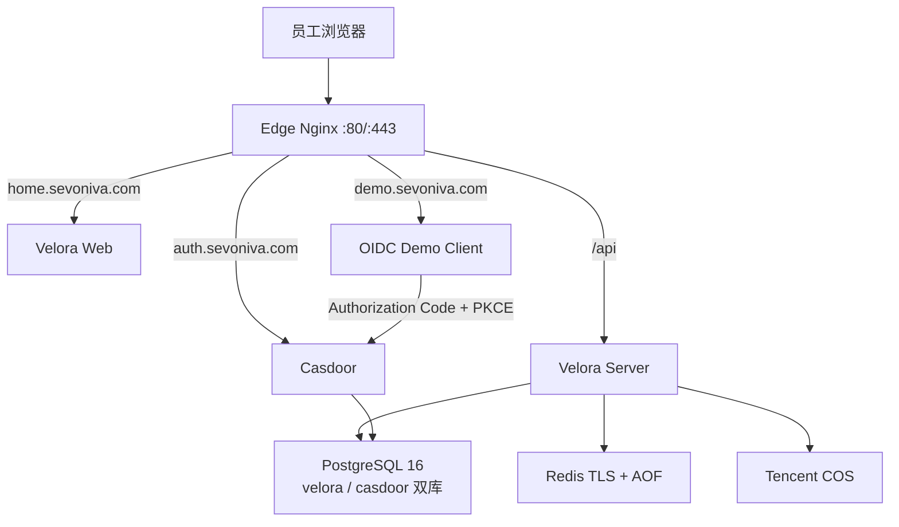

# Velora 新服务器整体建设与上线方案

状态：二次 Review 完成，待用户确认后实施
目标服务器：`ubuntu@175.27.250.53`（4C / 8G / 约 98G 系统盘）
建设方式：全新部署，不迁移、不读取、不依赖旧服务器数据
环境方式：同一服务器承载逻辑隔离的开发环境和正式环境，不再依赖本地运行环境
计划域名：`home.sevoniva.com`、`auth.sevoniva.com`、`demo.sevoniva.com`

## 1. 结论

方案可实施，但不能把“代码能启动”和“金融级正式生产”混为一谈。建议分成两个明确里程碑：

1. **单机生产首发**：在当前 4C / 8G 服务器上完成真实 OIDC、Velora 登录、Casdoor SSO、Demo App、应用接入后台、TLS、备份、监控与安全验收，可供真实应用接入和受控用户使用。
2. **金融级生产完成态**：补齐多节点高可用、经批准的国密 KMS/HSM、异地灾备、WORM/SIEM、容量与故障演练、外部安全测试后，才能声明金融级/银行级生产能力。

当前服务器足够完成第一个里程碑，但单机天然无法消除主机、Docker、数据库和网络的单点故障。方案不会伪造 HA 或商密认证结论。

## 2. 已确认决策

| 项目 | 决策 |
|---|---|
| 门户 | `https://home.sevoniva.com` |
| 公网身份域 | `https://auth.sevoniva.com`，直接承载 Casdoor 标准 OIDC 根地址 |
| 参考应用 | `https://demo.sevoniva.com`，真实标准 OIDC Client |
| 登录入口 | 用户只在 Velora 页面输入账号密码并完成 Turnstile |
| Casdoor | 不改源码；普通用户不进入 Casdoor 登录/管理界面 |
| 管理边界 | 日常应用、发布和访问策略在 Velora；Casdoor 高级控制台仅给受权管理员 |
| OIDC Provider | Velora 不实现；Casdoor 是唯一身份协议提供方 |
| 数据 | 新环境全新初始化，不迁移旧用户、数据库和 Casdoor Application |
| 对象存储 | 腾讯云 COS 是首发目标；已有桶仍需在新环境重跑能力合同，完成前保持 `Not certified`，同时保留通用 S3 Provider 边界 |
| Crypto | 本轮使用 `standard` Profile + root-only 软件密钥；金融 Profile 继续保留真实国密 KMS/HSM 强制门禁 |
| 构建源 | Go 使用 `goproxy.cn`，pnpm 使用 `npmmirror`，OCI 镜像经 DaoCloud/受控国内源并固定 digest |
| 开发与发布 | 服务器直接开发、测试和构建；正式环境只运行通过门禁的不可变 commit 镜像 |
| Git | 全程在 `main` 开发，每个完整切片立即 Conventional Commit 并 push；不创建功能分支 |

## 3. 当前代码与目标之间的真实差距

以下项目在实施前仍是代码或真实环境缺口，不能标记为已完成：

1. 当前生产配置主动拒绝 Velora 代收 Casdoor 密码，与“Velora 页面是唯一登录入口”的产品决定冲突；必须以受控安全模式重构生产门禁，不能靠把环境伪装成开发环境绕过。
2. 当前 Velora 服务端校验 Casdoor 密码后没有为浏览器建立 `auth.sevoniva.com` 的 Casdoor SSO Session，下游 OIDC App 仍可能看到二次登录页。
3. 当前生产 Web 镜像只适合单域名入口；`home/auth/demo` 需要独立 Edge Nginx 和三个严格 Host 的 TLS Virtual Host。
4. 当前没有可部署的真实 OIDC Demo Client。
5. 当前应用验证主要验证 Discovery，尚未完整验证 Client ID、Redirect URI、Scopes、Grant Type 和真实浏览器登录。
6. 当前 HSM/KMS/PKCS#11 只是 `Adapter slot`；生产配置选择它会失败关闭，不能伪装成已经接入国密硬件。
7. 单台服务器没有 PostgreSQL/Redis/应用 HA；只能通过备份、快速重建和明确 RTO 降低风险，不能达到无单点目标。

## 4. 最终产品与技术架构



公网只开放 `22/80/443`。PostgreSQL、Redis、Velora Server、Casdoor、Web 和 Demo 均不发布宿主机公网端口。Edge 是唯一 TLS 终止与反向代理入口；未知 Host 直接拒绝。

### 同机开发/正式隔离

同一台物理服务器可以同时承担开发和正式环境，但不能复用同一组容器、数据库、Redis、Secret、网络和数据卷：

- 正式 Compose Project 固定为 `velora-prod`，只运行按 commit SHA 标记的不可变镜像，不挂载源码。
- 开发 Compose Project 固定为 `velora-dev`，只绑定 `127.0.0.1`，通过 SSH Tunnel 访问，不开放开发域名和公网端口。
- 开发数据库、Redis、Secret、网络和卷统一使用 `velora-dev-*`；正式环境统一使用 `velora-prod-*`。
- 开发环境按需启动，验证结束后停止；构建缓存和源码保留，避免重复下载依赖。
- 正式发布使用已经在开发环境通过测试的同一 commit 镜像，禁止在正式容器内编辑源码或临时打补丁。
- 正式环境已有用户后，构建和完整测试使用 CPU/内存限制并避开发布切换窗口，避免抢占正式服务资源。

### 登录和下游 SSO

1. 浏览器在 Velora 提交账号、密码和 Turnstile Token。
2. Velora 执行限流、Turnstile 服务端校验，并通过内网请求 Casdoor。
3. Casdoor 校验身份；Velora完成 OIDC Token 的签名、Issuer、Audience、Nonce 和有效期验证。
4. Velora 创建本地会话和 30 秒一次性 Session Bridge Ticket。
5. 浏览器用隐藏表单整页 POST 到 `auth.sevoniva.com/_velora/session/bridge`，设置 Host-only Casdoor Session Cookie 后返回 Velora；Ticket 不进入 URL。
6. 用户启动 Demo 或其他应用；应用走标准 Authorization Code + PKCE，Casdoor 因已有 SSO Session 直接回调，不显示第二个密码页。

密码、Casdoor Session ID、Bridge Ticket、授权码和 Token 不落数据库、不进前端存储、不进日志。Bridge Ticket 使用 Redis 原子一次性消费并失败关闭。

### Velora 与 Casdoor 产品边界

| 能力 | Velora | Casdoor |
|---|---|---|
| 用户登录体验 | 唯一用户入口、Turnstile、错误提示、会话编排 | 实际凭据校验与身份会话 |
| 应用目录 | 应用信息、分类、图标、上下架、启动入口 | 不承载门户产品体验 |
| 应用接入 | 向导、验证、审批、发布状态、证据 | OIDC Client/Redirect/Scopes 的身份侧事实 |
| 访问控制 | 哪些用户可见、可启动，后端强制 | 身份、组织、角色等权威来源 |
| 管理入口 | 日常管理和受控 Casdoor 高级入口 | 高级 IdP 运维，不对普通用户开放 |
| OIDC Issuer | 不是 Issuer | 唯一 Issuer：`https://auth.sevoniva.com` |

“Casdoor 不暴露给普通用户”定义为：正常登录、应用启动、错误页和退出流程不出现 Casdoor 品牌登录页或管理界面，Velora 普通用户界面不提供 Casdoor 链接。OIDC Discovery、JWKS、Authorize、Token、UserInfo 和 Logout 属于标准协议端点，必须公网可达，因此不能宣称 Casdoor 的网络地址完全不可见。`auth` 根路径和静态资源不能在未验证 Casdoor 路由前强制重定向，以免破坏协议或管理控制台；高级控制台入口使用 Velora 专用权限、二次确认和审计，Casdoor 自身仍执行管理员认证授权。

## 5. 单机资源方案

| 服务 | CPU 上限 | 内存上限 | 持久化 |
|---|---:|---:|---|
| Edge + Web | 0.50C | 384 MiB | 无 |
| Velora Server | 1.00C | 1024 MiB | 无 |
| Casdoor | 0.75C | 768 MiB | PostgreSQL |
| Demo | 0.25C | 128 MiB | 无 |
| PostgreSQL | 1.25C | 2048 MiB | 独立数据卷 |
| Redis | 0.25C | 384 MiB | AOF 数据卷 |
| 备份/健康检查任务 | 0.25C | 256 MiB | 按时运行，不常驻完整监控栈 |

正式环境稳定内存目标不超过 5 GiB；开发环境按需限制在 1.5 GiB 内，为内核、Docker Cache、备份和升级保留空间。现有 2 GiB Swap 只作为故障缓冲。数据库限制连接数和慢查询；Docker 日志默认 `20m × 5` 轮转。本轮不部署 Prometheus/Grafana，不做长期运行观察或生产压力测试。

## 6. 目录、配置和 Secret

```text
/opt/velora/
├── source/                     # main 源码、Go/pnpm/Docker 构建缓存
├── dev/                        # velora-dev Compose、独立 Secret 与数据卷
├── prod/
│   ├── releases/<commit>/      # 每次不可变发布产物
│   ├── current -> releases/<commit>
│   └── runtime/
│       ├── compose/
│       ├── certs/<domain>/
│       ├── secrets/
│       ├── backups/
│       └── evidence/
└── scripts/                    # 发布、回滚、备份和健康检查
```

- `dev` 和 `prod/runtime` 不进入 Git；Secret 目录 `0700`，Secret/私钥 `0600`。
- `.env` 只放非敏感选择项；密码、DSN、Client Secret、Turnstile Secret、COS 密钥和 Crypto Key 全部使用文件注入。
- 三套证书已验证域名、链和私钥匹配；DNS 切换后仍需验证线上实际证书链。
- 证书有效期约 90 天，配置 30/15/7 天告警与无中断轮换步骤。

## 7. 分阶段实施方案

全程直接在 `main` 开发。每个阶段开始前执行 `git pull --ff-only` 并确认工作树干净；完成聚焦测试后立即 Conventional Commit 和 push。禁止创建功能分支、强推、变基、覆盖用户修改或积压多个阶段后一次性提交。

### P0：服务器开发基线与生产配置

- 在新服务器安装 Docker/Compose、Go、Node/pnpm、Git 和必要检查工具，全部使用受控国内源。
- 建立 `source/dev/prod` 目录和完全隔离的两个 Compose Project；开发环境仅绑定 `127.0.0.1`。
- 固化镜像、Go、Node/pnpm 版本和依赖锁，生成 SBOM/依赖证据。
- 修正生产配置冲突：只有 Turnstile、HTTPS、Redis Bridge、限流、Casdoor OIDC 和安全 Cookie 全部配置时，才允许 Velora 表单登录。
- 首发固定 `VELORA_COMPLIANCE_PROFILE=standard`，允许 root-only Secret 文件提供标准软件加密；必须显式标记非金融级。`financial` Profile 继续强制真实 KMS/HSM/PKCS#11 并失败关闭。
- 保持 Velora 自建 OIDC Provider 永久关闭。

退出门禁：配置单测、Secret 扫描、`make verify`、开发 Compose 和生产配置静态检查全部通过。

### P1：公网身份域、Edge 与 Session Bridge

- 将公网 Issuer 统一为 `https://auth.sevoniva.com`，内网访问使用 `http://casdoor:8000`。
- 新建全新 Casdoor Velora Client，配置精确回调和 Signin Session。
- 实现 Casdoor Cookie 捕获和 Redis 一次性 Bridge Ticket；浏览器仅使用 POST Body 提交 Ticket，GET Bridge 一律拒绝。
- 拆分 Edge Nginx 与内部 Web 服务，完成 home/auth/demo 三域名 TLS、严格 Host、默认拒绝和安全头。
- 明确登出语义：Velora 退出清理 Velora + Casdoor；Demo 退出清理 Demo + Casdoor并回跳 Velora，不虚假承诺跨域直接删除其他 Host-only Cookie。

退出门禁：Ticket 不可重放、不进入 URL/日志，Cookie 安全属性正确，Issuer/Discovery/JWKS 一致，Turnstile 和登录失败全部失败关闭。

### P2：真实 OIDC Demo Client

- 新增 Go 单二进制 Demo，非 root、只读根文件系统、无数据库。
- 实现 Authorization Code + PKCE S256、State、Nonce、服务端 Session 和已定义的登出链路。
- 新建独立 Casdoor Demo Client，并在 Velora 创建默认仅管理员可见的 Demo 应用。

退出门禁：从 Velora 启动 Demo 不二次输入密码；非法 State/Nonce/PKCE/Redirect、未授权启动全部被拒绝。

### P3：应用接入产品闭环

- 将“应用管理、身份与单点登录、访问策略”整合为一个接入向导。
- 状态固定为 `DRAFT → IDENTITY_PENDING → VERIFICATION_PENDING → READY → PUBLISHED → DISABLED`。
- 分项验证 Discovery/Issuer、JWKS、Client ID、Redirect URI、Scopes、Grant Type 和真实浏览器登录。
- OIDC 应用默认拒绝访问；列表、详情和启动 API 三层统一鉴权。
- 日常配置在 Velora；Casdoor 高级入口只给拥有专用权限的管理员。

退出门禁：未验证应用不可发布，未授权用户不可见且无法绕过启动，配置漂移可诊断。

### P4：正式发布与确定性验收

- 从空卷初始化正式 PostgreSQL 双库、Redis 和 Casdoor，不导入旧服务器任何数据。
- 在服务器开发环境完成全部测试，以同一 commit SHA 构建不可变正式镜像并切换生产 Compose。
- DNS 未切换前使用 `curl --resolve` 验证三个 HTTPS Host；通过后再切换 A 记录到 `175.27.250.53`。
- 验证 DNS、TLS、端口、健康检查、登录、Demo SSO、管理员入口、权限拒绝、退出和容器重启恢复。
- 完成腾讯云 COS 基础能力验证，以及一次双库备份和隔离恢复验证。
- 输出最终账号初始化、应用接入、配置、发布、回滚和故障排查文档。

退出门禁：所有确定性验收通过且无阻断级或高危缺陷。本轮不执行生产压力测试、长时间观察、HA、真实 KMS/HSM、WORM/SIEM 或异地灾备。

### 后续增强（不交给本轮开发）

多节点 HA、托管 PostgreSQL/Redis、真实国密 KMS/HSM、异地灾备、WORM/SIEM、容量与故障演练和外部测评继续保留为后续项；缺少这些证据时不得声明金融级或银行级完成。

## 8. 测试与验收清单

### 代码门禁

- Go：单元/集成、race、vet、staticcheck、gosec、govulncheck。
- Web：lint、类型检查、单测、生产构建、登录与后台 E2E。
- Contract：Proto/OpenAPI 生成一致，前后端接口一致。
- Deployment：Compose config、镜像非 root/只读、Secret、端口、健康检查和国内源检查。
- Supply chain：锁文件、digest、SBOM、许可证和 Secret 扫描。

### 真实用户旅程

1. Velora 页面账号密码 + Turnstile 登录成功。
2. 错误密码给出专业、不可枚举的提示；不会产生半登录会话。
3. 管理员登录后能看到应用、身份、策略、审计和受控 Casdoor 入口。
4. 普通用户看不到管理入口。
5. 从 Velora 启动 Demo，不出现 Casdoor 登录页和第二次密码输入。
6. 未授权用户在列表、详情和直接 URL/API 三层被拒绝。
7. 登出后 Velora、Casdoor SSO、Demo 会话行为符合定义。
8. 服务/主机重启、Redis Ticket 丢失、Casdoor 暂时不可用时失败可诊断且不降级绕过。

## 9. 安全与运维要求

- SSH 仅密钥，禁 root 和密码远程登录；防火墙仅开放 `22/80/443`。
- Turnstile Secret 只在 Server，所有验证服务端完成；登录接口按 IP、账号和设备维度限流。
- 所有 Cookie 使用 Host-only、Secure、HttpOnly；禁止 `Domain=.sevoniva.com`。
- 不记录密码、Token、Client Secret、Cookie、Bridge Ticket、完整 Claims 和敏感请求体。
- 每日双库加密备份到 COS 独立前缀，保留 7 日备和 4 周备；备份成功不等于可恢复，必须定期恢复演练。
- 使用腾讯云基础主机监控、Docker Healthcheck、日志轮转和本地检查脚本；本轮不部署完整监控平台。检查覆盖磁盘、证书、容器、5xx、数据库连接和备份结果。
- 发布始终使用不可变 commit/image digest；每次发布保留上一版本产物和配置摘要。

## 10. 回滚方案

本方案不依赖旧服务器回滚：

1. **DNS 回滚**：切换前保留低 TTL；新环境异常时将记录暂停或切回用户指定的安全目标，不自动指回旧机。
2. **代码回滚**：`current` 软链接切到上一已验证 release，按 digest 重启 `edge/web/server/demo`。
3. **配置回滚**：恢复上一份加密/受控配置版本和证书挂载，运行静态门禁后重启。
4. **数据库回滚**：Schema 只做向前兼容的 additive migration；优先回滚应用，不执行破坏性 Down。需要恢复时只从新环境备份在隔离实例演练后执行。
5. **身份回滚**：可关闭 Bridge/Demo/接入向导开关，但不能恢复 Velora 自建 OIDC Provider，也不能降级到不受保护的明文密码模式。

新服务器出现失败时保留容器日志、配置摘要和数据卷，不删除证据后重装。

## 11. AI 开发效率约束

- P0–P4 由 AI 连续推进，不套用人工团队的工作日估算。
- 不以反复规划、状态汇报、等待观察或生产压测代替实际开发。
- 能自动获取、安装、生成、测试和修复的内容由 AI 直接完成，不等待用户操作。
- 每完成一个可运行切片立即测试、Conventional Commit 并 push，然后继续下一切片。
- 测试失败必须定位并修复；只有缺少 DNS 变更、外部凭据或其他不可推导的用户输入时才暂停并一次性说明。
- 完成标准以 P0–P4 的确定性测试和真实 E2E 证据为准，不以开发耗时为准。

## 12. 开始实施条件

实施前只需确认这一份整体方案。确认后按 P0 → P4 在服务器 `main` 连续推进、分阶段提交和 push；任何阶段退出门禁未通过就继续修复，不部署半成品，也不提前宣称生产完成。
