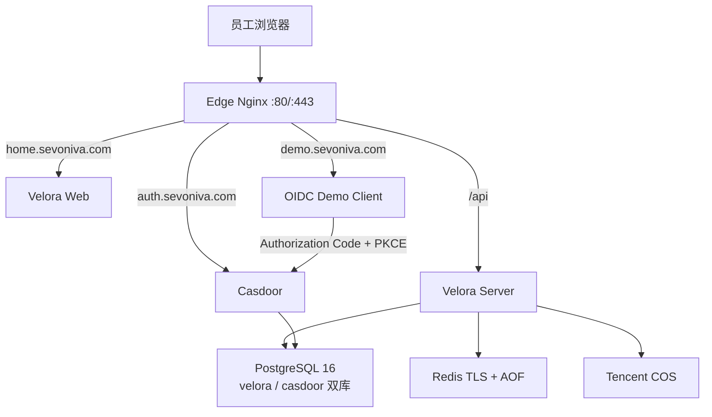

# Velora 新服务器整体建设与上线方案

状态：待用户确认，尚未实施
目标服务器：`ubuntu@175.27.250.53`（4C / 8G / 约 98G 系统盘）
建设方式：全新部署，不迁移、不读取、不依赖旧服务器数据
计划域名：`home.sevoniva.com`、`auth.sevoniva.com`、`demo.sevoniva.com`

## 1. 结论

方案可实施，但不能把“代码能启动”和“金融级正式生产”混为一谈。建议分成两个明确里程碑：

1. **单机生产首发**：在当前 4C / 8G 服务器上完成真实 OIDC、Velora 登录、Casdoor SSO、Demo App、应用接入后台、TLS、备份、监控与安全验收，可供真实应用接入和受控用户使用。
2. **金融级生产完成态**：补齐多节点高可用、经批准的国密 KMS/HSM、异地灾备、WORM/SIEM、容量与故障演练、外部安全测试后，才能声明金融级/银行级生产能力。

当前服务器足够完成第一个里程碑，但单机天然无法消除主机、Docker、数据库和网络的单点故障。方案不会伪造 HA 或商密认证结论。

## 2. 已确认决策

| 项目 | 决策 |
|---|---|
| 门户 | `https://home.sevoniva.com` |
| 公网身份域 | `https://auth.sevoniva.com`，直接承载 Casdoor 标准 OIDC 根地址 |
| 参考应用 | `https://demo.sevoniva.com`，真实标准 OIDC Client |
| 登录入口 | 用户只在 Velora 页面输入账号密码并完成 Turnstile |
| Casdoor | 不改源码；普通用户不进入 Casdoor 登录/管理界面 |
| 管理边界 | 日常应用、发布和访问策略在 Velora；Casdoor 高级控制台仅给受权管理员 |
| OIDC Provider | Velora 不实现；Casdoor 是唯一身份协议提供方 |
| 数据 | 新环境全新初始化，不迁移旧用户、数据库和 Casdoor Application |
| 对象存储 | 腾讯云 COS 是首发目标；已有桶仍需在新环境重跑能力合同，完成前保持 `Not certified`，同时保留通用 S3 Provider 边界 |
| 构建源 | Go 使用 `goproxy.cn`，pnpm 使用 `npmmirror`，OCI 镜像经 DaoCloud/受控国内源并固定 digest |
| 发布方式 | 本地完成测试和构建，上传不可变产物；服务器主要负责运行，不现场长时间编译 |

## 3. 当前代码与目标之间的真实差距

以下项目在实施前仍是代码或真实环境缺口，不能标记为已完成：

1. 当前生产配置主动拒绝 Velora 代收 Casdoor 密码，与“Velora 页面是唯一登录入口”的产品决定冲突；必须以受控安全模式重构生产门禁，不能靠把环境伪装成开发环境绕过。
2. 当前 Velora 服务端校验 Casdoor 密码后没有为浏览器建立 `auth.sevoniva.com` 的 Casdoor SSO Session，下游 OIDC App 仍可能看到二次登录页。
3. 当前生产 Web 镜像只适合单域名入口；`home/auth/demo` 需要独立 Edge Nginx 和三个严格 Host 的 TLS Virtual Host。
4. 当前没有可部署的真实 OIDC Demo Client。
5. 当前应用验证主要验证 Discovery，尚未完整验证 Client ID、Redirect URI、Scopes、Grant Type 和真实浏览器登录。
6. 当前 HSM/KMS/PKCS#11 只是 `Adapter slot`；生产配置选择它会失败关闭，不能伪装成已经接入国密硬件。
7. 单台服务器没有 PostgreSQL/Redis/应用 HA；只能通过备份、快速重建和明确 RTO 降低风险，不能达到无单点目标。

## 4. 最终产品与技术架构



公网只开放 `22/80/443`。PostgreSQL、Redis、Velora Server、Casdoor、Web 和 Demo 均不发布宿主机公网端口。Edge 是唯一 TLS 终止与反向代理入口；未知 Host 直接拒绝。

### 登录和下游 SSO

1. 浏览器在 Velora 提交账号、密码和 Turnstile Token。
2. Velora 执行限流、Turnstile 服务端校验，并通过内网请求 Casdoor。
3. Casdoor 校验身份；Velora完成 OIDC Token 的签名、Issuer、Audience、Nonce 和有效期验证。
4. Velora 创建本地会话和 30 秒一次性 Session Bridge Ticket。
5. 浏览器整页跳转到 `auth.sevoniva.com/_velora/session/bridge`，设置 Host-only Casdoor Session Cookie 后返回 Velora。
6. 用户启动 Demo 或其他应用；应用走标准 Authorization Code + PKCE，Casdoor 因已有 SSO Session 直接回调，不显示第二个密码页。

密码、Casdoor Session ID、Bridge Ticket、授权码和 Token 不落数据库、不进前端存储、不进日志。Bridge Ticket 使用 Redis 原子一次性消费并失败关闭。

### Velora 与 Casdoor 产品边界

| 能力 | Velora | Casdoor |
|---|---|---|
| 用户登录体验 | 唯一用户入口、Turnstile、错误提示、会话编排 | 实际凭据校验与身份会话 |
| 应用目录 | 应用信息、分类、图标、上下架、启动入口 | 不承载门户产品体验 |
| 应用接入 | 向导、验证、审批、发布状态、证据 | OIDC Client/Redirect/Scopes 的身份侧事实 |
| 访问控制 | 哪些用户可见、可启动，后端强制 | 身份、组织、角色等权威来源 |
| 管理入口 | 日常管理和受控 Casdoor 高级入口 | 高级 IdP 运维，不对普通用户开放 |
| OIDC Issuer | 不是 Issuer | 唯一 Issuer：`https://auth.sevoniva.com` |

“Casdoor 不暴露给普通用户”定义为：正常登录、应用启动、错误页和退出流程不出现 Casdoor 品牌登录页或管理界面；直接访问 `auth` 根路径时跳回 Velora。OIDC Discovery、JWKS、Authorize、Token、UserInfo 和 Logout 属于标准协议端点，必须公网可达，因此不能宣称 Casdoor 的网络地址完全不可见。高级控制台入口使用 Velora 专用权限、二次确认和审计，不能仅凭知道 URL 就获得管理权。

## 5. 单机资源方案

| 服务 | CPU 上限 | 内存上限 | 持久化 |
|---|---:|---:|---|
| Edge + Web | 0.50C | 384 MiB | 无 |
| Velora Server | 1.00C | 1024 MiB | 无 |
| Casdoor | 0.75C | 768 MiB | PostgreSQL |
| Demo | 0.25C | 128 MiB | 无 |
| PostgreSQL | 1.25C | 2048 MiB | 独立数据卷 |
| Redis | 0.25C | 384 MiB | AOF 数据卷 |
| 轻量监控/任务 | 0.50C | 768 MiB | 指标与日志卷 |

稳定内存目标不超过 5.5 GiB，为内核、Docker Cache、备份和升级保留至少 1.5 GiB。现有 2 GiB Swap 只作为故障缓冲。数据库限制连接数和慢查询；Docker 日志默认 `20m × 5` 轮转。

## 6. 目录、配置和 Secret

```text
/opt/velora/
├── releases/<commit>/          # 每次不可变发布产物
├── current -> releases/<commit>
├── runtime/
│   ├── compose/
│   ├── certs/<domain>/
│   ├── secrets/
│   ├── backups/
│   └── evidence/
└── scripts/
```

- `runtime` 不进入 Git；目录 `0700`，Secret/私钥 `0600`。
- `.env` 只放非敏感选择项；密码、DSN、Client Secret、Turnstile Secret、COS 密钥和 Crypto Key 全部使用文件注入。
- 三套证书已验证域名、链和私钥匹配；DNS 切换后仍需验证线上实际证书链。
- 证书有效期约 90 天，配置 30/15/7 天告警与无中断轮换步骤。

## 7. 分阶段实施方案

每阶段完成测试后立即 Conventional Commit 并 push；失败即停在当前阶段，不带病进入下一阶段。

### S0：代码与发布基线

- 保留当前 `main` 作为代码回滚点；方案在 `codex/redeploy-175-27-250-53` 分支审阅，确认后继续在 `codex/` 实施分支开发。
- 固化镜像、Go、Node/pnpm 版本和国内源，生成 SBOM/依赖证据。
- 修正生产配置冲突：新增受控的 Velora 表单登录模式，只有 Turnstile、HTTPS、Redis Bridge、限流、Casdoor OIDC 和安全 Cookie 全部配置时才允许启动。
- 保持 Velora 自建 OIDC Provider 永久关闭。
- 明确 Crypto 两条路径：首发若无批准的 KMS/HSM，只能标记为受控首发，不能声明金融级；正式金融级必须安装真实 adapter 并通过目标验证。

退出门禁：生产配置单测、Secret 扫描、`make verify`、镜像构建和配置静态门禁全部通过。

### S1：公网身份域与 Session Bridge

- 将公网 Issuer 统一为 `https://auth.sevoniva.com`，内网访问使用 `http://casdoor:8000`。
- 新建全新 Casdoor Velora Client，配置精确回调和 Signin Session。
- 实现 Cookie 捕获、一次性 Bridge Ticket、严格 Host 校验、303 返回和三层登出。
- Redis 从第一次启动即启用 TLS、认证、AOF、容量上限和 `noeviction`。
- 拆分 Edge Nginx 与 Web 静态服务，完成三域名路由和默认拒绝 Host。

退出门禁：Ticket 不可重放，Cookie 为 Host-only/HttpOnly/Secure/SameSite=Lax，日志无敏感内容，Issuer/Discovery/JWKS 全部一致。

### S2：真实 OIDC Demo Client

- 新增 Go 单二进制 Demo，非 root、只读根文件系统、无数据库。
- 实现 Authorization Code + PKCE S256、State、Nonce、服务端 Session、标准 Logout。
- 新建独立 Casdoor Demo Client，Redirect URI 精确为 `https://demo.sevoniva.com/oauth/callback`。
- 在 Velora 创建 Demo 应用，默认仅管理员可见。

退出门禁：从 Velora 启动 Demo 不二次输入密码；非法 State/Nonce/PKCE/Redirect 全部失败关闭。

### S3：应用接入产品闭环

- 将“应用管理、身份与单点登录、访问策略”整合为一个接入向导。
- 状态固定为 `DRAFT → IDENTITY_PENDING → VERIFICATION_PENDING → READY → PUBLISHED → DISABLED`。
- 分项验证 Discovery/Issuer、JWKS、Client ID、Redirect URI、Scopes、Grant Type 和最近一次真实浏览器登录。
- OIDC 应用默认拒绝访问；发布前必须显式选择所有人或目录范围，列表、详情和启动 API 三层统一鉴权。
- 日常配置在 Velora；Casdoor 高级入口只给拥有专用权限的管理员。

退出门禁：未验证应用不可发布，未授权用户不可见且无法绕过启动，配置漂移可诊断。

### S4：新服务器全新部署

- 只在用户确认后执行主机基线、Docker/Compose、目录、Secret、证书和防火墙安装。
- 从空卷初始化 PostgreSQL 双库、Redis 和 Casdoor，不导入旧服务器任何数据。
- 运行数据库迁移，创建一次性高强度 break-glass 管理员密码并要求首次使用后轮换。
- 本地构建 Linux/amd64 产物和镜像；服务器只加载/运行签名或校验过的产物。
- 使用 `curl --resolve` 在 DNS 未切换时验收三个 HTTPS Virtual Host。

退出门禁：所有容器健康、仅 22/80/443 对公网监听、数据库/Redis 无公网端口、三域名证书正确、重启后自动恢复。

### S5：DNS 切换与真实验收

- 用户将 `home/auth/demo` 三个 A 记录切换到 `175.27.250.53`；切换前建议 TTL 调整为 300 秒。
- 从公网、Mac 和服务器三侧验证 DNS、TLS、HSTS、Discovery、登录、Demo SSO、退出和权限拒绝。
- 验证 Turnstile 正常、超时、重复 Token、无 Token、Cloudflare 不可达时均失败关闭。
- 完成数据库备份到 COS和一次隔离恢复演练。
- 执行基础压力、24 小时稳定性观察、磁盘/证书/5xx/登录失败/备份告警。

退出门禁：验收清单全部有真实证据，无 P0/P1 缺陷，才宣布单机生产首发完成。

### S6：金融级完成态

- 至少两台应用节点和独立负载均衡。
- PostgreSQL/Redis 使用经过验证的高可用或云托管方案。
- 接入经批准的国密 KMS/HSM/PKCS#11 adapter，完成密钥轮换、吊销、恢复和双人复核。
- 完成异地备份/PITR/灾备演练、WORM/SIEM、容量测试、故障注入、外部渗透和合规证据。

S6 不阻塞受控单机首发，但它阻塞“金融级/银行级正式生产”声明。

## 8. 测试与验收清单

### 代码门禁

- Go：单元/集成、race、vet、staticcheck、gosec、govulncheck。
- Web：lint、类型检查、单测、生产构建、登录与后台 E2E。
- Contract：Proto/OpenAPI 生成一致，前后端接口一致。
- Deployment：Compose config、镜像非 root/只读、Secret、端口、健康检查和国内源检查。
- Supply chain：锁文件、digest、SBOM、许可证和 Secret 扫描。

### 真实用户旅程

1. Velora 页面账号密码 + Turnstile 登录成功。
2. 错误密码给出专业、不可枚举的提示；不会产生半登录会话。
3. 管理员登录后能看到应用、身份、策略、审计和受控 Casdoor 入口。
4. 普通用户看不到管理入口。
5. 从 Velora 启动 Demo，不出现 Casdoor 登录页和第二次密码输入。
6. 未授权用户在列表、详情和直接 URL/API 三层被拒绝。
7. 登出后 Velora、Casdoor SSO、Demo 会话行为符合定义。
8. 服务/主机重启、Redis Ticket 丢失、Casdoor 暂时不可用时失败可诊断且不降级绕过。

## 9. 安全与运维要求

- SSH 仅密钥，禁 root 和密码远程登录；防火墙仅开放 `22/80/443`。
- Turnstile Secret 只在 Server，所有验证服务端完成；登录接口按 IP、账号和设备维度限流。
- 所有 Cookie 使用 Host-only、Secure、HttpOnly；禁止 `Domain=.sevoniva.com`。
- 不记录密码、Token、Client Secret、Cookie、Bridge Ticket、完整 Claims 和敏感请求体。
- 每日双库加密备份到 COS 独立前缀，保留 7 日备和 4 周备；备份成功不等于可恢复，必须定期恢复演练。
- 监控不对公网开放；告警覆盖磁盘、证书、容器、5xx、登录失败率、数据库连接和备份。
- 发布始终使用不可变 commit/image digest；每次发布保留上一版本产物和配置摘要。

## 10. 回滚方案

本方案不依赖旧服务器回滚：

1. **DNS 回滚**：切换前保留低 TTL；新环境异常时将记录暂停或切回用户指定的安全目标，不自动指回旧机。
2. **代码回滚**：`current` 软链接切到上一已验证 release，按 digest 重启 `edge/web/server/demo`。
3. **配置回滚**：恢复上一份加密/受控配置版本和证书挂载，运行静态门禁后重启。
4. **数据库回滚**：Schema 只做向前兼容的 additive migration；优先回滚应用，不执行破坏性 Down。需要恢复时只从新环境备份在隔离实例演练后执行。
5. **身份回滚**：可关闭 Bridge/Demo/接入向导开关，但不能恢复 Velora 自建 OIDC Provider，也不能降级到不受保护的明文密码模式。

新服务器出现失败时保留容器日志、配置摘要和数据卷，不删除证据后重装。

## 11. 预计工期

| 工作 | 预计时间 |
|---|---:|
| S0 生产门禁与发布基线 | 0.5–1 天 |
| S1 公网 Issuer、Bridge、Edge、Redis | 1.5–2.5 天 |
| S2 Demo Client 与真实 SSO | 0.5–1 天 |
| S3 应用接入产品闭环 | 2–3 天 |
| S4 全新服务器部署 | 0.5–1 天 |
| S5 E2E、恢复、压力和稳定性 | 1–2 天 + 24 小时观察 |

第一条真实 OIDC 闭环约 3–5 天，完整单机生产首发约 6–10 个工作日。S6 取决于额外服务器、KMS/HSM、灾备与外部测评资源，不包含在单机首发工期内。

## 12. 开始实施条件

实施前只需确认这一份整体方案。确认后按 S0 → S5 连续推进、分阶段提交和 push；任何阶段退出门禁未通过就停止，不部署半成品，也不提前宣称生产完成。
