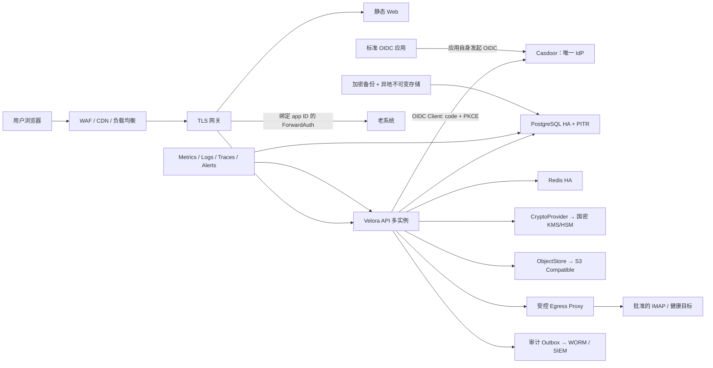

# Velora 生产级、金融级与产品级就绪度评估

> 评估日期：2026-08-20
> 评估版本：历史快照；当前代码证据以 `codex/velora-forge-backend-replacement` 的 `83f7fbf` 及 [`production-implementation-status.md`](production-implementation-status.md) 为准。
> 范围：本仓库源码、配置、容器编排、脚本、测试、运维文档及本地登录页
> 结论性质：工程评估，不替代等保测评、渗透测试、法律意见或金融监管验收

> **状态说明（后端替换后，2026-08-20）**：本文第 1—10 节保留了替换前快照的风险证据和决策背景；下面的“当前实施状态”是本次 go-antd-fullstack 替换后的权威状态。替换后的后端源码、配置、路由和迁移以当前分支为准，不能再把旧 Gin/GORM/自建 OIDC Provider 的行号当作现状证据。

## 当前实施状态（权威）

### 结论

后端已经实际切换到 `go-antd-fullstack` 的 Kratos/Proto 基座，Go module 为 `github.com/sevoniva-labs/velora/server`；`web/` 未修改，Casdoor 未修改且仅作为外部 OIDC Provider。R0—R3 的代码骨架和主要闭环已经落地，但尚未取得金融生产 Go 资格：真实 Casdoor 互操作、MinIO/COS 目标契约、国密 KMS/HSM、HA/灾备、外部渗透和等保测评仍需在目标环境验收。

### 已交付

| 波次 | 实施内容 | 证据 |
|---|---|---|
| R0 | 脚手架替换、模块路径、Kratos HTTP/gRPC、Proto/OpenAPI、配置、迁移命令、健康/就绪、生产 Compose、回滚点 | `server/cmd/server`、`server/cmd/migrate`、`server/api/proto`、`deployments/env/prod` |
| R1 | Casdoor OIDC Client；Authorization Code + PKCE(S256)、state/nonce、一次性服务端 transaction cookie、生产关闭密码登录和自建 Provider 路由 | `server/internal/platform/identitysource`、`server/internal/adapters/kratosapi/federated_login.go` |
| R2 | 应用目录、分类、标签、收藏、最近访问、应用策略（EVERYONE/USER/ROLE/GROUP/ORGANIZATION）、审计事务和权限菜单 | `server/internal/domain/portal`、`server/internal/app/portal`、migration `00022_portal.sql` |
| R3 | S3-compatible ObjectStore（MinIO/COS 等通过 endpoint/profile）、安全对象 key、checksum/SSE、能力证据 fail-closed、版本化 envelope crypto、SM 软件 Provider 基线、生产部署模板 | `server/internal/platform/storage`、`server/internal/platform/security/crypto`、`deployments/env/prod` |

### 本次验收证据

- 在 `server/` 中执行的 `make ci-go`、`make security-tools`、`make ci-deploy` 已通过；仓库根目录 `make test` 也通过（包含未修改前端的 lint/test/build）。
- 临时 PostgreSQL 15 集群已从 00001—00022 完整迁移；启动后 `/api/v1/system/health` 和 `/api/v1/system/ready` 返回成功。
- 真实 API smoke 已验证：登录、管理员创建分类、创建应用、门户列表、收藏、收藏列表、启动 URL；并验证了审计事务中的 PostgreSQL 游标关闭回归。
- 生产 Compose 静态门禁通过：仅 Web 发布 80/443，数据库、Redis、Casdoor、server、监控不发布 host port，`initData=false`，无默认凭据；Docker daemon 不可用，因此未宣称容器运行时验收通过。
- `git diff --name-only` 未出现 `web/`；Casdoor 服务源码未进入替换范围。

### 未完成且禁止宣称已通过的门槛

1. Casdoor 真实 discovery、授权、回调、登出、MFA、claims/角色映射和撤权 E2E；需要目标 Casdoor 环境和批准的 client/redirect 配置。
2. MinIO 与腾讯云 COS 的真实目标契约（multipart、checksum、SSE、versioning、object-lock/presign）及证据归档；代码默认对高级能力 fail-closed。
3. `gm` 当前是软件国密 Provider 基线，不等于商密认证或 KMS/HSM；金融生产必须接入已审计的国密 KMS/HSM/PKCS#11 adapter，并完成密钥轮换演练。
4. PostgreSQL/Redis HA、PITR、跨地域备份恢复、WORM/SIEM 审计、容量/故障注入、外部渗透、等保/金融监管测评。
5. ForwardAuth 目标应用的可信 app-id/host 绑定和下游应用自身 OIDC 配置；门户隐藏按钮不是下游授权边界。

因此当前判定为：**代码替换可实施，开发/隔离预发可继续；金融生产仍 NO-GO，必须完成上述目标环境证据后再 Go/No-Go。**

### 当前整改映射（2026-08-21）

本文后续 P0/P1 表格保留历史发现、原始行号和决策背景，不应直接当作当前未修复清单。当前代码侧已落地：

- P0-01/P0-05/P0-06：独立生产 Compose、HTTPS/origin fail-fast、Casdoor Authorization Code + PKCE、生产关闭密码登录。
- P0-03/P0-04/P0-08：生产关闭 Velora OIDC Provider；应用启动仅允许 HTTPS 目标 URL；ForwardAuth 按应用 ID 走统一 `CanAccess` 并要求网关剥离伪造头。
- P0-07/PROD-01/PROD-02/PROD-03：迁移使用 session lock；生产 Redis/S3 fail-closed；新增 Velora/Casdoor 双库同时间戳备份编排；Nginx `/healthz` 代理 server readiness，依赖异常返回 503。
- SEC-09/IAM-03：登录输入有界、限流状态有容量上限，生产 OIDC session TTL 不超过 1 小时；OIDC transaction cache key 使用 state 哈希。
- P1/P2 产品范围：邮件、待办不在当前产品范围且生产 UI 不展示；门户设置页明确只读，不再提供必然失败的保存按钮。

仍未关闭的是目标环境能力和外部证据：真实 Casdoor/MFA/撤权 E2E、MinIO/COS 契约、批准 KMS/HSM/国密适配器、PITR/异地不可变恢复、HA/容量/故障注入、WORM/SIEM、渗透测试和合规签字。它们不应通过继续修改页面或伪造测试结果标记为已完成。

## 1. 执行结论

**总体结论：金融生产环境 NO-GO；普通企业生产环境 NO-GO；隔离的内部试点可在 P0 全部关闭后有条件上线。**

Velora 已具备较完整的企业门户 MVP：统一入口、Casdoor 身份集成、服务端会话、权限、应用中心、Todo、邮件、审计、隐私导出和基础可观测性均已有实现，登录页的桌面与移动端视觉质量也较好。当前问题不是“缺少功能页面”，而是身份协议、生产编排、供应链、备份恢复、审计可信性及金融控制闭环尚未达到上线门槛。

| 维度 | 当前等级 | 结论 |
|---|---:|---|
| 产品完成度 | B- | 登录体验和响应式设计较成熟；核心已登录流程未完成真实环境端到端验收 |
| 工程质量 | C | 测试、lint、构建通过，但后端语句覆盖率仅 26.6%，多个关键包为 0% |
| 应用安全 | D+ | 存在失效的登录限流、SSRF、令牌撤销不完整、邮件隐私绕过和已知依赖漏洞 |
| 身份与协议 | D | ROPC 不支持金融级 MFA；自建 OIDC Provider/应用启动流程不符合标准客户端预期 |
| 生产可靠性 | D | 单机 Compose、迁移锁无效、健康检查失真、Redis 可静默降级 |
| 灾备与审计 | D | 备份不完整且恢复可假成功；审计链可重算、归档会破坏在线验证 |
| 金融与合规控制 | D | 无数据分级、KMS/HSM、双人复核、职责分离、合规证据闭环 |

“金融级”不是一个单独证书。本报告把它定义为：在生产基线之上，增加强身份、最小权限、数据全生命周期、不可抵赖审计、双人复核、业务连续性、供应链治理和可证明的控制有效性。本项目目前是**企业应用门户**，并非资金交易或核心账务系统；若未来处理支付、账务或客户资金，还必须另行建设双重记账、幂等、对账、差错处理、反欺诈/反洗钱及 PCI DSS 等适用控制。

### 1.1 当前后端规模与脚手架可复用性

按当前工作树静态统计（不含前端）：

| 指标 | 数量 | 判断 |
|---|---:|---|
| Go 总行数 | 13,444 | 已不是空脚手架，但仍属于中小型单体后端 |
| 非测试 Go 行数 | 10,813 | 有真实业务实现和一定重构成本 |
| 测试 Go 行数 | 2,631 | 测试存在，但之前实测语句覆盖率仅 26.6% |
| Go package | 28 | 领域已拆分，主要耦合集中在启动组装和 HTTP 路由注册 |
| 测试文件 | 24 | 认证、会话、权限、限流、审计等已有单元测试 |
| 路由注册 | 73 | 已是产品后端，不应按“脚手架项目”整体推倒 |
| 数据库迁移 | 8 个文件、约 20 个建表/索引/变更语句 | 已形成数据兼容和回滚约束 |

当前结构是 Gin + GORM + PostgreSQL/SQLite + Redis 的模块化单体。最大文件集中在 `application`、`auth`、`mail` 和旧 `oidcprovider`；启动依赖在 `server/cmd/velora/main.go` 与 `server/internal/platform/httpserver/server.go` 集中组装。因此，若新的后端脚手架只是基础 CRUD、路由、配置和数据库模板，不值得替换当前实现；若它已经具备经过验证的 OIDC Client、密钥/配置治理、迁移锁、可观测性、容器生产基线和 CI 安全门禁，才值得采用“保留领域代码、迁移平台层”的方式复用。

后续拿到新脚手架后按以下门槛对比：

1. 能否在不传递用户密码的前提下完成 Casdoor Authorization Code + PKCE、state/nonce/transaction 绑定和 session 撤销。
2. 是否有严格配置校验、无默认 Secret、数据库迁移锁、健康检查、优雅退出、结构化日志和指标。
3. 是否有可替换的对象存储、CryptoProvider、邮件/外部网络 egress policy 接口。
4. 是否有 race/vet/覆盖率、依赖漏洞、SAST、容器/IaC、SBOM 和恢复演练门禁。
5. 迁移现有 73 个路由、8 个 migration、权限策略和审计链的成本是否低于直接在当前代码上整改。

在新脚手架未通过上述对比前，推荐以当前仓库为基线做 P0 整改，不先做大规模迁移。

### 1.2 已确认的目标架构决策

以下决策作为后续实现的硬约束，除非另行形成 ADR，不再让开发人员自行选择：

1. **Casdoor 是唯一身份提供方，Velora 不改造 Casdoor。** Velora 仅通过 Casdoor 已有的标准 OIDC/OAuth 能力完成登录和读取标准 claims；不依赖修改 Casdoor 源码，也不通过管理员 API 修改用户、密码或角色。
2. **Velora 只做 OIDC Client（Relying Party），暂不做 OIDC Provider。** 当前 `server/internal/oidcprovider` 自建身份提供方不作为生产能力，先通过 feature flag 默认关闭外部 `/oidc/*`，完成兼容性确认后再删除运行时代码；已执行的数据库迁移不得回滚或删除。
3. **OIDC 的直白解释：** 用户点“登录”后，Velora 把浏览器跳到 Casdoor；Casdoor 完成密码/MFA 后只把一次性 code 回给 Velora；Velora 后端用 code 换取身份信息并建立自己的服务端 session。用户密码不经过 Velora。这是 [OpenID Connect Authorization Code Flow](https://openid.net/specs/openid-connect-core-1_0-18.html)。
4. **身份与授权分层。** Casdoor 提供“这个人是谁、拥有哪些角色/组”等身份事实；Velora 决定“该身份可以看到和启动哪些应用”。应用的真正入口仍必须执行授权：标准 OIDC 应用直接对接 Casdoor 并自行授权；老系统使用绑定可信 app ID/Host 的 Velora ForwardAuth，不能只依赖门户隐藏按钮。
5. **应用启动不再由 Velora 拼装 authorize/state/PKCE。** `launch_url` 表示目标应用自己的登录发起地址或首页，由目标应用生成 state、nonce、PKCE 并跳转 Casdoor。Velora 只做已授权后的安全跳转。
6. **对象存储采用 S3-compatible 抽象。** 第一版只实现一个通用 S3 adapter，通过 endpoint、region、bucket、path-style、TLS 和凭据配置兼容 [MinIO](https://min.io/docs/minio/linux/index.html)、[腾讯云 COS](https://intl.cloud.tencent.com/zh/document/product/436/34688) 及其他 S3 兼容服务，不为每个厂商复制业务代码。具体高级特性要做能力探测，不能假设完全一致。
7. **密码能力采用可插拔 CryptoProvider。** 支持 `standard` 与 `gm` 能力集，国密模式的 SM2/SM3/SM4 必须由经过审查的库、KMS/HSM、[PKCS #11](https://docs.oasis-open.org/pkcs11/pkcs11-spec/v3.2/pkcs11-spec-v3.2.pdf) 或厂商服务提供，禁止自行实现算法。密文必须保存 `version + provider + algorithm + keyId + nonce + ciphertext + createdAt`，支持双 key 轮换与后台 rewrap。
8. **国密不等于修改 OIDC 算法。** 由于 Velora 不再签发下游 OIDC token，OIDC 协议兼容性由 Casdoor 负责；Velora 的国密能力主要覆盖邮件凭据、备份、对象存储和内部敏感数据。TLS/TLCP、商密产品认证及具体算法组合在部署环境确定后单独验收。

## 2. 评估依据与证据边界

参考基线：

- [《网络安全法》2025 年修正决定（2026-01-01 施行）](https://www.npc.gov.cn/npc/c1773/c1848/c21114/wlaqfxz/wlaqfxz002/202511/t20251103_449242.html)
- [《个人信息保护法》](https://www.npc.gov.cn/WZWSREL25wYy9jMi9jMzA4MzQvMjAyMTA4L3QyMDIxMDgyMF8zMTMwODguaHRtbD9yZWY9aW1i)与[《数据安全法》](https://www.npc.gov.cn/npc/c2/c30834/202106/t20210610_311888.html)
- [GB/T 22239-2019 网络安全等级保护基本要求](https://std.samr.gov.cn/gb/search/gbDetailedCNF?id=88F4E6DA63434198E05397BE0A0ADE2D)
- [JR/T 0071.2-2020 金融行业网络安全等级保护实施指引](https://std.samr.gov.cn/hb/search/stdHBDetailed?id=B62CB2BE71201CD5E05397BE0A0A83BC)
- [JR/T 0171-2020 个人金融信息保护技术规范](https://cfstc.pbc.gov.cn/bzgk/detail/?bzId=1856&id=0)、[JR/T 0197-2020 金融数据安全分级指南](https://cfstc.pbc.gov.cn/bzgk/detail/?bzId=1873&id=0)、[JR/T 0223-2021 金融数据生命周期安全规范](https://cfstc.pbc.gov.cn/bzgk/detail/?bzId=1913&id=0)
- [OWASP ASVS 5.0](https://owasp.org/www-project-application-security-verification-standard/)、[NIST CSF 2.0](https://www.nist.gov/publications/nist-cybersecurity-framework-csf-20)

已执行的证据：

- `make test`：Go 测试、前端 lint、29 个 Vitest、TypeScript 和生产构建通过。
- `go test -race -coverprofile=... ./...` 与 `go vet ./...`：通过；后端总语句覆盖率 26.6%。
- `govulncheck ./...`：命中调用链的已知漏洞 25 个，涉及 Go 1.25.6 标准库及 `x/text`、`x/net`、`pgx`、`go-jose`、`quic-go`。
- `pnpm audit --prod --registry=https://registry.npmjs.org`：未发现已知生产依赖漏洞；项目默认镜像源不支持 audit API。
- `docker compose ... config --format json`：确认生产 overlay 合并后仍发布 `5433`、`8080`、`8443`、`5173`，并同时发布 `80/443`。
- 登录页在 1280×720 与 390×844 下完成视觉、键盘、校验和服务不可用状态检查。

限制：本机 Docker daemon 不可用，因此没有启动 PostgreSQL、Casdoor 和后端；未执行真实登录、已登录业务流、负载、故障注入、恢复演练、外部渗透或等保测评。文中涉及这些环节的结论均按“缺少可验证证据”处理，而不是宣称已经通过。

## 3. 发布阻断项（P0）

| ID | 问题与证据 | 风险 | 必须实施的修改 | 验收标准 |
|---|---|---|---|---|
| P0-01 | 生产 Compose 继承开发端口和固定凭据：`docker-compose.yml:22-23, 60-75, 84-85, 145-146`；实测合并后 `postgres:5433`、`server:8080`、`casdoor:8443`、`web:5173` 均暴露，且 PostgreSQL 仍为 `postgres/postgres` | 绕过 TLS/Nginx 直接访问后端和数据库；默认凭据可导致完全接管 | 将开发与生产编排拆开；生产只发布网关 443，数据库、后端、Casdoor、Redis、监控仅 `expose` 到隔离网络；所有数据库用户和密码由 Secret Manager 注入，禁用 `initData` | `docker compose config` 仅出现经批准入口；外网端口扫描只有 443；无默认口令；数据库按最小权限分账户 |
| P0-02 | `server/go.mod:3,31,40,54,63,66` 固定 Go 1.25.6 和易受攻击依赖；`govulncheck` 报告 25 个可达漏洞 | DoS、解析异常、SQL 占位符混淆、JOSE 崩溃等已知风险进入生产 | Go 至少升级到 1.25.13；`x/text>=0.39.0`、`x/net>=0.55.0`、`pgx>=5.9.2`、`go-jose>=4.1.4`、`quic-go>=0.59.1`，重新解析依赖并回归 | CI 中 `govulncheck ./...` 为 0；镜像 SBOM 与漏洞扫描无超出风险接受单的 High/Critical |
| P0-03 | 当前仓库自建 Velora OIDC Provider 声明支持 OIDC，却不返回 `id_token`：`server/internal/oidcprovider/handler.go:53-70,180-188,259-268` | 如果暴露给下游 RP，标准客户端无法完成认证；继续维护会扩大身份系统攻击面 | 不再把 Velora 作为 Provider：生产默认关闭 `/oidc/*` 和 `VELORA_OIDC` 接入类型，停止创建新 client/key/token；保留已执行 schema，确认无现存消费者后再清理运行时代码 | 生产路由扫描不存在外部 `/oidc/*`；没有新 OIDC key/token 写入；架构测试确认登录只使用 Casdoor issuer；现存消费者清单已签字确认 |
| P0-04 | 应用启动错误地由门户生成目标 RP 的 `state`，且把随机串直接当作 S256 challenge：`server/internal/application/launch.go:48-86,89-137` | RP 没有对应 state/verifier，回调失败且安全校验无法成立 | 删除门户拼装 authorize 参数的行为；`launch_url` 只保存目标应用自身的登录发起 URL/首页，由目标应用生成 state、nonce、PKCE 后直连 Casdoor | 标准 OIDC 应用从门户启动后由应用自身发起登录；跨浏览器 state、错误 verifier、错误 redirect 测试均拒绝；Velora URL 中不生成目标应用 verifier |
| P0-05 | 生产未设置 `PUBLIC_BASE_URL`，默认 `http://localhost:8080`：`server/internal/config/config.go:42-44,96`，生产 overlay 和 `.env.example` 均缺失 | Casdoor 登录 callback、ForwardAuth、应用跳转与回跳 URL 在生产错误或降级 HTTP | 生产强制 `PUBLIC_BASE_URL=https://实际域名`，校验 HTTPS、host 白名单，禁止默认值启动 | 登录发起、callback、cookie domain、ForwardAuth 与网关外部 URL 一致；错误/HTTP/localhost 配置启动失败 |
| P0-06 | 主登录使用 Casdoor ROPC：`web/src/pages/Login.tsx:39-43,78-96`；RFC 9700 明确 ROPC MUST NOT 使用且无法支持交互式 MFA | 用户密码经过门户，扩大凭据暴露面；金融级 MFA、WebAuthn、风险认证无法落地 | 使用 Casdoor 原生 Authorization Code + PKCE；这是配置 OIDC client/redirect URI，不是改造 Casdoor。生产隐藏/关闭密码代理端点，用户资料与改密跳到 Casdoor 自助页面 | 所有生产登录均跳转 Casdoor；密码不经过 Velora；state/nonce/PKCE 与浏览器 transaction 绑定；Casdoor 未启用 MFA 时由部署检查给出阻断或显式风险接受，见 [RFC 9700](https://www.rfc-editor.org/info/rfc9700/) |
| P0-07 | 备份只覆盖 Velora DB、不含 Casdoor；文件未加密；对象存储工具缺失时仍成功：`scripts/backup-db.sh:35-96`。恢复会吞掉 DROP/restore 错误且容器模式无法读取宿主 dump：`scripts/restore-db.sh:37-74` | 身份与业务数据不一致、备份泄露、灾难时恢复失败但显示成功 | 使用数据库级/PITR 方案同时保护 Velora 与 Casdoor；客户端或 KMS 信封加密、签名/校验和、异地不可变存储；恢复脚本任何错误立即失败；恢复到新环境后自动验数 | 连续 3 次季度演练达到批准的 RPO/RTO；恢复后登录、权限、OIDC、邮件凭据、审计链抽检通过；演练报告可审计 |
| P0-08 | 应用策略只在门户列表/Launch 层检查；ForwardAuth 只验任意有效会话，OIDC authorize 也未按 `Client.ApplicationID` 执行应用策略：`server/internal/application/handler.go:159-168`、`server/internal/forwardauth/handler.go:35-47`、`server/internal/oidcprovider/handler.go:101-124` | 被角色、组织、用户组或白名单拒绝的用户可绕过门户，直接访问下游 URL 或发起 OIDC 授权 | ForwardAuth 必须由可信 Host/route 解析 app ID 并执行统一 `CanAccess`；OIDC 发 code 前按 client 的 ApplicationID 加载启用应用并执行相同策略；未知 audience 默认拒绝 | 直接访问下游 URL、直接调用 authorize、禁用应用、撤权四类绕过测试均返回拒绝；网关传入的 app/audience 不可由客户端伪造 |

## 4. 高优先级问题（P1）

| ID | 问题与证据 | 影响 | 实施方案与验收 |
|---|---|---|---|
| SEC-01 | 敏感端点“10/30/60 次”限流实际共用 `Limit:300` 的实例；`n/window` 只进入 key：`server/internal/platform/httpserver/server.go:68-74,146-149,234-251` | 密码喷洒、撞库和锁号 DoS 防护弱于设计 | 为每个策略创建独立 limiter，策略进入计数算法而非只进 key；登录同时按 IP、账号、设备/ASN 分层限速；生产 Redis 不可用时敏感端点 fail-closed。单测明确第 11 次登录返回 429 |
| SEC-02 | 当前改密只撤销 Portal session，且忽略撤销错误；历史 Velora OIDC token 也未被可靠撤销：`server/internal/usercenter/handler.go:24-40,103-112`；`server/internal/oidcprovider/service.go:487-492` | 改密后旧 session/token 仍可能继续使用，且本地改密与“Casdoor 唯一身份源”冲突 | 生产下线 Velora 本地改密并跳转 Casdoor 自助入口；统一撤销本地 session、服务端保存的 Casdoor access/refresh 凭据及历史 Velora token，失败必须告警并可重试。Velora 不调用 Casdoor 管理 API 修改密码 |
| SEC-03 | 健康检查仅阻止字面 localhost/link-local，不解析 DNS，允许私网且默认跟随重定向：`server/internal/application/health.go:69-111` | 有应用管理权限的人可让服务探测内网、DNS 重绑定或通过重定向访问禁区 | 解析全部 A/AAAA 并在连接前后校验；默认禁止私网/回环/链路本地/元数据；每次 redirect 重新验证；独立 egress proxy/网络策略；响应体限长。SSRF 测试覆盖 DNS、IPv6、重定向 |
| SEC-04 | 用户可配置任意 IMAP host/port，后端立即 TLS 拨号：`server/internal/mail/imap.go:35-55` | 已登录用户可对内网 TLS 服务进行探测/连接 | 仅允许批准域名或经 egress policy 的目标；解析后阻止内部网段；限制端口为 993；租户级开关与审计。内网/metadata/重绑定测试全部拒绝 |
| SEC-05 | 邮件“默认拦截外部图片”只禁 ``，DOMPurify 保留 `style=background-image:url(...)`：`web/src/components/mail/MailDetailDrawer.tsx:16-25,55-62,145-156`；已用当前依赖实测 CSS URL 被保留 | 远程追踪像素仍可泄露用户 IP、时间和邮件打开行为 | 未授权显示图片时同时移除 `style/src/srcset/background` 和所有远程 URL；更稳妥是在 sandboxed iframe 中渲染并通过受控图片代理。用 CSS、SVG、picture、srcset、重定向样例做隐私回归 |
| SEC-06 | Todo 推送未校验 URL scheme，前端直接 `window.open`：`server/internal/todo/handler.go:67-77,121-164`；`web/src/components/TodoCenter.tsx:80-87` | 被盗/恶意集成令牌可向用户投递钓鱼或危险 scheme | 服务端只允许批准的 `https` host；前端再次用 URL parser 拒绝非 HTTPS；显示来源域名和离站提示；集成 token 按来源系统/目标用户最小授权 |
| SEC-07 | IMAP `FetchBody` 先拉完整 RFC822，再在解析阶段对单个 part 限 2 MiB：`server/internal/mail/imap.go:127-156,264-299` | 大邮件导致内存、带宽和 goroutine 被耗尽 | 拉取前依据 RFC822.SIZE 拒绝超限，使用 partial fetch/流式总量限制，账号并发配额与超时；100MB 邮件压测不应造成显著内存尖峰 |
| SEC-08 | OIDC state 虽有签名/PKCE/nonce，但未绑定发起浏览器的一次性 cookie 或服务端 transaction：`server/internal/auth/oidc.go:74-110`、`server/internal/auth/handler.go:98-123` | 攻击者可把自己未消费的 callback URL 交给受害者，造成登录 CSRF/会话置换 | 登录发起时设置 HttpOnly/Secure/SameSite=Lax transaction cookie，服务端保存其哈希和 verifier；回调要求 state、cookie、issuer、redirect、一次性记录全匹配。跨浏览器回调测试必须失败 |
| SEC-09 | 公开登录无应用级请求体/字段上限，内存锁定表对唯一用户名可永久增长；生产 Redis 又非必需：`server/internal/auth/handler.go:148-155`、`server/internal/platform/lockout/lockout.go:30-84` | 超大 JSON 或轮换 IP/用户名可造成内存耗尽与认证不可用 | 全局及登录路由使用 `MaxBytesReader`，限制 username/password/token 长度；生产强制 Redis；内存 fallback 增加 TTL 清理、最大基数和淘汰。资源耗尽压测不能触发 512MB OOM |
| IAM-01 | 旧 Velora OIDC Provider 的 grant/scopes 未被严格执行：`server/internal/oidcprovider/handler.go:75-124,170-235` | 任何继续使用旧 Provider 的消费者都可能获得超范围身份信息 | 将其作为退役阻断项：生产硬关闭 Provider 路由和签发能力，盘点并迁移消费者到 Casdoor；不再投入修补这套 Provider。验收时 Provider 路由不可达且不能产生新 token |
| IAM-02 | 旧 OIDC 私钥明文存于数据库：`server/migrations/0004_oidc_provider.sql:62`；`server/internal/oidcprovider/service.go:156-168` | DB 或备份泄露可用于伪造历史 Velora token | 立即停止签发、撤销/失效旧 `kid`，按留存期清理数据库和备份中的私钥材料并留下审计证据；不为已退役 Provider 新建 KMS。历史 migration 文件只保留，不回改 |
| IAM-03 | 角色、组和组织在登录时写入 session 快照，默认 TTL 168 小时；后续只检查 session 未吊销：`server/internal/auth/session.go:124-193`、`server/internal/config/config.go:89-90` | 管理员降权、用户停用或移出敏感组后，旧会话最长 7 天仍保留权限 | 优先通过标准 OIDC refresh/userinfo 更新 claims；如 Casdoor 配置无法及时刷新，则将敏感/管理员 session 缩短到 1 小时并强制重新认证，高风险操作 step-up。无需改造 Casdoor，也不依赖其管理 API |
| PROD-01 | 迁移使用 `pg_advisory_xact_lock`，但锁语句不在事务内：`server/internal/platform/db/db.go:56-66,94-109` | autocommit 后锁立即释放，多实例启动迁移可竞争 | 用同一 transaction/session 获取锁、执行全部迁移并释放；更推荐把迁移从应用启动剥离为单实例发布 Job。并发启动 5 个实例只允许一个执行迁移 |
| PROD-02 | Redis 未配置或连接失败会静默降级为进程内实现：`server/cmd/velora/main.go:112-130` | 多实例限流和账号锁定不一致，攻击者可跨实例绕过 | 生产要求 Redis/等价强一致存储，启动/readyz 在不可用时失败；仅开发允许降级；加入 Redis 故障演练 |
| PROD-03 | Web 容器健康检查访问 HTTP，但 TLS 模式 80 会重定向；外部 `/healthz` 又只是 Nginx 固定 200：`deployments/docker/Dockerfile.web:26`、`deployments/docker/velora-https.conf.template:68-71` | 容器可能误判不健康，或后端/DB 已坏仍向外报健康 | 容器检查使用不重定向的本地端点；LB readiness 代理到 server `/readyz`，liveness 与 readiness 分离；加入 Redis/Casdoor 依赖策略和超时预算 |
| AUD-01 | 审计 SHA 链不含 User-Agent/Request-ID，写入 fail-open 且错误被吞：`server/internal/audit/service.go:50-85,136-163` | 敏感操作可能无审计；DB 管理员可改记录后重算整链 | 高风险写操作使用同事务 outbox，审计失败阻止或进入隔离队列；链使用 HMAC/数字签名并定期锚定到 WORM/外部时间戳；纳入所有字段；审计失败触发 paging |
| AUD-02 | `VerifyChain(startID)` 从空前驱开始，增量验证错误：`server/internal/audit/service.go:239-262`；归档删除前段后也会破坏在线链；脚本注释称 3 年，实际按 180 天删：`scripts/audit-archive.sh:3-10,43-57` | 校验误报或无法证明历史完整性，保留策略与实现不一致 | startID 前读取上一条 hash/锚点；归档文件签名、加密、行数与 digest 入审计；删除前写入新在线 genesis anchor；保留期来自批准的数据保留矩阵 |
| OBS-01 | 名为 `Velora5xxRateHigh` 的规则实际检查 audit failure，未采集按状态 HTTP 计数；无 Alertmanager、TLS/外部探测、备份/容量告警：`deployments/monitoring/alerts.yml:15-26` | 事故不可及时发现，SLO 不可计算 | 增加 RED/USE 指标、结构化 trace、外部 SLI、证书/备份/容量/依赖告警和通知路由；定义 SLO、错误预算、值班和 runbook；故障演练验证告警送达 |
| OBS-02 | monitoring profile 发布 Prometheus 9090 和 Grafana 3000，Grafana 默认 `admin/admin`；生产文档支持与生产 overlay 合并启动：`docker-compose.yml:164-195`、`docs/ops-deploy.md:71-77` | 监控平面信息泄露或被默认口令接管 | 生产不发布 3000/9090，只经内部网络或 SSO 网关；Grafana 密码无默认值、由 Secret 注入；部署检查发现 `admin/admin` 直接失败 |
| SDLC-01 | 仓库无 CI 配置，也无 SAST、依赖/Secret/容器/IaC/SBOM/许可证扫描；Docker 构建在 frozen lock 失败后会普通安装：`deployments/docker/Dockerfile.web:5-11` | 不可复现构建，漏洞和密钥可能进入发布物 | 建立受保护 CI：test/race/vet、E2E、govulncheck、npm audit、gosec/semgrep、secret、Trivy、SBOM、license、签名和 provenance；`--frozen-lockfile` 失败即失败；镜像使用可信 registry 和 digest |
| DATA-01 | 无正式数据分类、处理目的、保留/删除、跨境和 DSAR 流程；所谓“全量导出”是管理员接口且有范围/数量限制 | 不足以宣称个保法或金融数据合规 | 建数据资产与处理活动清单，按 JR/T 0197 分类分级；记录合法性基础、最小化、保留期、删除/更正/导出、跨境；高风险处理做 PIPIA；每项控制保留证据和责任人 |
| DATA-02 | 邮件密钥轮换会让历史凭据永久不可解密：`scripts/rotate-secrets.sh:10-15,59-69` | 定期轮换等同业务中断，泄露时无法平滑处置 | 采用版本化 envelope encryption：每条密文保存 key version，后台 rewrap/re-encrypt，双 key 宽限和可回滚；密钥仅在 KMS，禁止写 `.env` |
| FIN-01 | 管理操作、数据导出、OIDC client/token、策略变更缺少 maker-checker、职责分离和 step-up MFA | 单个管理员误操作或被盗即可完成高风险变更 | 按职责拆分 IAM/安全审计/运维/业务管理员；高风险动作双人审批、短时授权、step-up MFA、不可由本人审批；每季度权限复核 |

## 5. 产品级问题（P2）

1. **错误恢复不产品化。** 后端不可用时登录页直接显示“请求失败（HTTP 502）”，来源为 `web/src/api/client.ts:5-16,79-84`。应映射为“服务暂时不可用，请稍后重试”，提供重试、状态页/支持入口和可复制的 requestId，技术状态码放详情。
2. **表单缺少持久可见 label。** `web/src/pages/Login.tsx:174-195` 只使用 placeholder。补 `<Form.Item label>` 或明确的 `aria-label/aria-labelledby`，错误与输入关联；以 WCAG 2.2 AA 做 axe + 键盘 + 屏幕阅读器验收。
3. **嵌套交互控件语义错误。** AppCard 是 `div role=button` 内嵌收藏 Button（`web/src/components/AppCard.tsx:98-150`）；Todo 的 `div role=button` 内嵌完成 button（`web/src/components/TodoCenter.tsx:149-181`）。拆成真实 `<a>/<button>` 的并列操作，避免键盘/读屏和事件冒泡冲突。
4. **登录文案与能力不一致。** 页面称统一认证但只有 ROPC 密码框；README 声称另有 Sign in with SSO（`README.md:155`）。完成授权码登录后统一文档和页面，否则删除未交付承诺。
5. **已登录核心旅程缺少验收证据。** 本次只能验证登录桌面、移动、校验和 502 状态；应用查找/启动、收藏、Todo、邮件、管理员配置、权限拒绝、空/错/慢状态应形成 Playwright E2E 和产品验收清单。
6. **前端首屏成本偏高。** 当前构建 `antd-core` 约 1,022 KiB（gzip 326 KiB），`react-vendor` 约 318 KiB（gzip 100 KiB），且 Vite 提示 `advancedChunks` 已废弃（`web/vite.config.ts:21-46`）。应路由懒加载、减少 Pro/Antd 全量路径、改用 `codeSplitting`，以真实 Web Vitals 设预算。
7. **产品文档漂移。** `docs/architecture.md:24,95` 和 `.env.example:37` 仍描述无状态会话，但代码已启用服务端 session；`README.md:25` 截图仍待补充。发布时自动生成配置参考和版本化架构决策记录。

视觉检查的正面结论：登录页层级清楚、品牌区与表单区关系稳定，390px 移动端无明显溢出，键盘 focus 和必填错误状态可见。这些优点应保留，不需要重做视觉方向。

## 6. 目标生产架构

生产原则：公网只有网关；服务与数据分网段；身份、应用、数据库分别最小权限；密钥不落数据库/镜像/.env；迁移由发布 Job 单例执行；核心状态依赖不可静默降级；审计和备份有独立信任域。

## 7. 分阶段实施路线

### 阶段 0：0–2 周，解除发布阻断

| 交付 | 责任角色 | 完成定义 |
|---|---|---|
| 生产编排重构、关闭开发端口/默认凭据 | 平台/SRE | P0-01 验收全过，外部扫描留证 |
| Go/依赖安全升级和 CI 最小门禁 | 后端/安全 | `make test`、race、vet、govulncheck、前端 audit 全绿 |
| `PUBLIC_BASE_URL`、Redis、Secret 强制生产校验 | 后端/平台 | 错配启动失败，readyz 能反映依赖 |
| 备份脚本止血 | DBA/SRE | 同时备份两库、加密、上传失败即失败；恢复脚本不再吞错 |
| Casdoor OIDC 登录替换 ROPC，冻结自建 Provider | 产品/IAM | 密码不经过 Velora；生产 `/oidc/*` Provider 路由关闭；现有消费者完成盘点 |

### 阶段 1：2–6 周，身份与安全闭环

- ROPC 迁移到 Casdoor Authorization Code + PKCE + MFA；修复浏览器 transaction 绑定、claims 映射和 session 续期，不再开发 Velora OIDC Provider。
- 修复限流、统一凭据撤销、Todo URL、健康检查和 IMAP egress；为每项增加滥用用例测试。
- 邮件凭据和备份接入 CryptoProvider；实现版本化密文与平滑轮换，国密 adapter 只调用已审查提供者。
- 建立 ObjectStore 接口和通用 S3 adapter；以 MinIO 做集成测试，以腾讯云 COS 做配置契约与预发布验证。
- 高风险管理操作接入 step-up、双人复核和职责分离。

### 阶段 2：6–12 周，可靠性、审计与产品验收

- PostgreSQL/Redis 高可用、PITR、容量和故障切换；应用多实例、滚动发布和回滚。
- 审计 outbox、签名/WORM/SIEM、可验证归档；补齐登录、权限、密钥、数据导出、配置变更等审计事件。
- 完整可观测性：SLO/SLI、错误预算、paging、runbook、合成监控和混沌/故障演练。
- Playwright 覆盖 7 条核心旅程；WCAG 2.2 AA；性能预算与真实 Web Vitals。
- 把后端关键包覆盖率提升到至少 70%，安全关键分支/协议状态机至少 90%。覆盖率是风险提示，不单独作为质量目标。

### 阶段 3：12 周以后，金融控制与外部证明

- 数据分类分级、处理活动台账、保留/删除/跨境和 PIPIA；建立季度权限复核和年度风险评估。
- 按实际业务定级开展等保备案、建设整改和第三方测评；金融机构适用时按 JR/T 0071.2 等形成控制映射。
- 独立渗透测试、红队、供应链/镜像签名、灾备演练和审计抽样；所有重大项关闭后由业务、风险、安全、SRE 联合签署 Go/No-Go。

## 8. 上线门禁与验收矩阵

金融生产发布必须同时满足：

- P0 为 0；P1 无未接受的 High 风险，风险接受有负责人、期限和补偿控制。
- Casdoor RP 互操作与 OIDC 负面测试通过；登录、MFA、改密跳转、登出、撤权、token/session 撤销 E2E 通过。
- 外部渗透测试无 Critical/High；SAST/SCA/Secret/IaC/镜像扫描纳入每次合并与发布。
- 生产网络扫描仅暴露批准入口；数据库强 TLS、最小权限，KMS/HSM 和密钥轮换演练通过。
- 明确 SLO（建议从月可用性 99.9% 起，由业务批准）、容量基线和峰值 2 倍负载测试；故障切换不超错误预算。
- RPO/RTO 由业务批准并经恢复演练实测；备份加密、异地、不可变且监控上传/恢复结果。
- 审计不可由单一数据库管理员静默改写；关键操作必有完整、可检索、可验证的记录。
- 数据分类、保留、删除、更正、导出、事件响应和监管报告流程有负责人、时限和演练记录。
- 产品核心旅程、错误/空/慢/权限拒绝、桌面/移动、无障碍与性能均有自动化和人工验收记录。

## 9. 推荐的实施拆单顺序

1. `INFRA-001` 拆分生产 Compose/部署清单，关闭所有继承端口和默认凭据。
2. `SEC-001` 升级 Go/依赖并建立漏洞门禁。
3. `IAM-001` ROPC → Casdoor Authorization Code + PKCE + MFA，禁止 Velora 接触密码。
4. `IAM-002` 生产关闭 Velora OIDC Provider/`VELORA_OIDC`，盘点消费者后逐步删除运行时代码。
5. `IAM-003` 统一 session/token/integration-token 撤销。
6. `SEC-002` 限流、SSRF/egress、Todo URL、邮件隐私与大消息限制。
7. `PLAT-001` ObjectStore S3 adapter + CryptoProvider 国密能力与密钥版本化。
8. `DR-001` 两库一致备份、加密/PITR、严格恢复和季度演练。
9. `AUD-001` 审计 outbox、外部锚定、WORM 和归档链修复。
10. `OBS-001` SLO、HTTP 指标、告警通知、合成监控和 runbook。
11. `DATA-001` 数据台账、分类分级、保留/删除、PIPIA 和职责分离。
12. `QA-001` E2E、性能、无障碍、故障注入和关键包覆盖率。
13. `GATE-001` 第三方渗透/等保适用性评估与联合 Go/No-Go。

## 10. 最终判定

Velora 的产品骨架和基础代码组织是可继续演进的，不建议推倒重写；但当前不能靠补几条配置直接达到金融生产级。优先顺序必须是：**先关闭生产暴露和已知漏洞，再修正身份协议和撤销闭环，随后完成灾备/审计/可观测性，最后以外部测评和演练证据做上线签署。**
